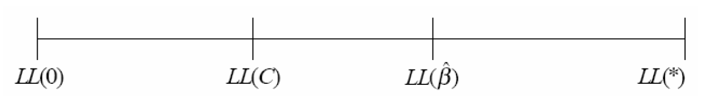

# Data Assembly and Estimation of Simple Multinomial Logit Models
```{r setup}
library(tidyverse)
library(haven)
library(mlogit)
library(modelsummary)
library(labelled)
library(knitr)
library(kableExtra)
```


## Introduction
This chapter describes the estimation of basic specifications for the multinomial logit (MNL) model including the collection and organization of data required for model estimation. The chapter is organized as follows: Section 5.2 presents an overview of the data required to estimate mode choice models.
Section 5.3 reviews data collection approaches for obtaining traveler and trip-related data. Section 5.4 discusses the methods for collecting data which
describes the availability and service characteristics of the various modal alternatives.  Section 5.5 illustrates two different data structures used by
software packages for estimation of MNL and NL models. Section 5.6 describes the data used to estimate work mode choice model in the San Francisco Bay Region. Section 5.7 describes preliminary estimation results for mode choice to work based on this data and interpret these results in terms of judgment, descriptive measures and statistical tests.  CHAPTER 6 extends this example to the estimation of more sophisticated models.  CHAPTER 7 develops a parallel example for shop/other mode choice in the San Francisco Bay Region.  CHAPTER 9 extends the examples from previous chapters and explores nested logit models for work and shop/other trips in the San Francisco Bay Region. Additional examples based on data collected in different urban regions are presented in the appendices.

## Data Requirements Overview

The first step in the development of a choice model is to assemble data about traveler choice and the variables believed to influence that choice process. In the context of travel mode choice, such data include:

  - Traveler and trip related variables that influence the travelers’ assessment of modal alternatives (*e.g.*, income, automobile ownership, trip purpose, time of day of travel, origin and destination of trip, and travel party size),
  - Mode related variables describing each alternative available to the traveler (e.g., travel time, travel cost and service frequency for carrier modes) and
  -	The observed or reported mode choice of the traveler (the “dependent” or “endogenous” variable).

The first two categories of variables are selected to describe the factors which influence each decision maker’s choice of an alternative.  These independent or exogenous variables are likely to differ across trip purpose.  The commonly used explanatory variables in mode choice models include:

  -	Traveler (Decision Maker) Related Variables
    *	Income of traveler or traveler's household, 
    *	Number of automobiles in traveler's household,
    *	Number of workers in traveler's household,
    *	Sex of the traveler,
    *	Age group of the traveler,
    *	Functions of these variables such as number of autos divided by number of workers and
  - Trip Context Variables 
    *	Trip purpose,
    *	Employment density at the traveler's workplace,
    *	Population density at the home location and
    *	Dummy variable indicating whether the traveler's workplace is in the Central Business District (CBD).
  - Mode (Alternative) Related Variables
    *	Total travel time,	
    *	In-vehicle travel time,	
    *	Out-of-vehicle travel time,	
    *	Walk time,
    *	Wait time,
    *	Number of transfers	
    *	Transit headway and	
    *	Travel cost.	
  - Interaction of Mode and Traveler or Trip Related Variables
    *	Travel cost divided by household income,
    *	Travel time or cost interacted with sex or age group of traveler, and
    *	Out-of-vehicle time divided by total trip distance.


## Sources and Methods for Traveler and Trip Related Data Collection

Traveler and trip related data (including the actual mode choice of the traveler) needed for estimation of mode choice models are generally obtained by surveying a sample of travelers from the population of interest.  This section discusses the types of surveys that may be used to obtain traveler and/or trip-related information (Section 5.3.1) and associated sample design considerations (Section 5.3.2).

### Travel Survey Types

There are several types of travel surveys.  The most common of these are household, workplace and intercept surveys.

**Household Travel Surveys** involve contacting respondents in their home and collecting information regarding their household characteristics (*e.g.*, number of members in household, automobile ownership, *etc*.), their personal characteristics (such as income, work status, *etc*.) and the travel decisions made in the recent past (*e.g.*, number of trips, mode of travel for each trip, *etc*.).  Historically, most household traveler surveys were conducted through personal interviews in the respondent’s home.  Currently, most household travel surveys are conducted using telephone or mail-back surveys, or a combination of both.  It is common practice to include travel diaries as a part of the household travel survey.  Travel diaries are a daily log of all trips (including information about trip origin and destination, start and end time, mode of travel, purpose at the origin and destination, *etc*.) made by each household member during a specified time period. This information is used to develop trip generation, trip distribution, and mode choice models for various trip purposes.  Recently, travel diaries have been extended to include detailed information about the activities engaged in at each stop location and at home to provide a better understanding of the motivation for each trip and to associate trips of different purposes with different members of the household.  Also, in some cases, diaries have been collected repeatedly from the same ‘panel’ of respondents to understand changes in their behavior over time.

**Workplace Surveys** involve contacting respondents at their workplace. The information collected is similar to that for household surveys but focuses exclusively on the traveler working at that location and on his/her work and work-related trips.  Such surveys are of particular interest in understanding work commute patterns of individuals and in designing alternative commuter services. 

**Destination Surveys** involve contacting respondents at other destinations.  Similar information is collected as for workplace surveys but the objective is to learn more about travel to other types of destinations and possibly to develop transportation services which better serve such destinations.  

**Intercept Surveys** “intercept” potential respondents during their travel.  The emphasis of the survey is on collecting information about the specific trip being undertaken by the traveler.  Intercept surveys are commonly used for intercity travel studies due to the high cost of identifying intercity travelers through home-based or work-based surveys.  In intercept surveys, travelers are intercepted at a roadside rest area for highway travel and on board carriers (or at carrier terminals) for other modes of travel.  The traveler is usually given a brief survey (paper or interview) for immediate completion or future response and/or recruited for a future phone survey.  A variant of highway intercept surveys is to record the license plate of vehicles and subsequently contact the owners of a sample of vehicles to obtain information on the trip that was observed. Intercept surveys can be used to cover all available modes or they can be used to enrich a household or workplace survey sample by providing additional observations for users of infrequently used modes since few such users are likely to be identified through household or workplace surveys.

### Sampling Design Considerations

The first issue to consider in sample design is the population of interest in the study. Obviously, the population of interest will depend on the purpose of the study. In the context of urban work mode choice analysis, the population of interest would be all commuters in the urban region. In the context of non-business intercity mode choice, the population of interest would be all non-business intercity travelers in the relevant corridor.  However, most surveys are designed to addresses a number of current or potential analysis and decision issues.  Thus, the population of interest is selected based on the full range of such issues and is likely to include a wide range of households and household members each undertaking a variety of trips.

After identifying the population of interest, the next step in sample design is to determine the unit for sampling. The sampling units should be mutually exclusive and collectively exhaust the population. Thus, if the population of interest is commuters in an urban region, the sampling unit could be firms in the area (whose employees collectively represent the commuting population). Within each firm, all or a sample of workers could be interviewed.  However, if the survey is addressed to multiple urban travel issues, the population of interest is likely to be all individuals or households resident in the urban region.  A comprehensive list of all sampling units constitutes the sampling frame. This may be a directory of firms or households obtained from a combination of public and private sources such as local or regional commerce departments, business directories, tourism offices, utilities, *etc*. Of course, the sampling frame may not always completely represent the population of interest. For example, some commuters may be employed by firms outside the urban region and some households may not have telephones or other utility connections.

Once the sampling frame is determined, a sampling design is used to select a sample of cases. The most common class of sampling procedures is probability sampling, where each sampling unit has a pre-determined probability of being selected into the survey sample. 

A probability sampling procedure in which each sampling unit has an equal probability of being selected is simple random sampling.  In this method, the sampling units are selected randomly from the sampling frame. This would apply to household sampling, for example. An alternative approach for work place sampling would be to sample each employer to further sample workers for those employers sampled.  This is referred to as a two-stage sample.  In either case, the result is an unbiased sample which is representative of the population of interest.  Simple random sampling offers the advantage of being easy to understand, communicate, and implement in the field, making it less prone to errors.  However, a random sample may not adequately represent some population segments of interest.  

This problem can be addressed by using stratified random sampling.  This entails partitioning the sampling frame into several mutually exclusive and collectively exhaustive segments (or strata) based on one or more stratification variables, followed by random sampling within each stratum. Thus, households in a region may be stratified by location within the region; city vs. suburban residence; or income.  Similarly, employment firms in a region may be stratified by the number of employees or the type of business. Stratified random sampling may be useful in cases where it is important to understand the characteristics of certain subpopulations as well as the overall population. For example, it might be useful to study the mode choice behavior of employees working for very small employers in a region and compare their behavior with those of employees working for large employers. But if the number of small employers in a region is a small proportion of all employers, they may not be well-represented in a simple random sample.  In such a case, the analyst might stratify the sampling frame to ensure adequate representation of very small employers in the survey sample. Stratified random sampling can also be less expensive than simple random sampling. This can occur, for example, because per-person sampling is less expensive if a few large employers are targeted rather than several smaller ones. Finally, increased dispersion in the range of important independent variables can be increased through “clever” identification of alternative strata based on income, household size, number of vehicles owned or number of workers providing benefits in estimation efficiency.

The use of stratified random sampling does not present any new problems in estimation as long as the stratification variable(s) is (are) exogenous to the choice process. However, in some situations, one may want to use the discrete choice of interest (the dependent or endogenous variable) as the stratification variable. For example, if the bus mode is rarely chosen for urban or intercity travel, a random sampling procedure or even an exogenously stratified sample might not provide sufficient observations of bus riders to understand the factors that affect the choice of the bus mode. In this case, bus riders can be intentionally over sampled by interviewing them at bus stops or on board the buses. Such choice based sampling may also be motivated by cost considerations. Special techniques are required to estimate model parameters using choice based sampling methods. 

A further problem is that it may be difficult to obtain a random sample as it may not be possible to get an up to date and complete list of potential respondents from which to select a sample. This is the primary reason for using "deterministic rules" of sampling. In systematic sampling, sample units are drawn by deterministic rather than random rules.  For example, rather than drawing a random sample of 5 percent all households in a region from a published directory, a systematic sampling plan may pick out every 20th household in the directory. As long as there is no inherent bias in setting up the deterministic rule, the systematic sampling plan is essentially equivalent to random sampling, and the choice of one over the other may be a matter of operational convenience.

In addition to the sampling approaches discussed above, combinations of the approaches can also be used.  For example, enriched sampling uses a combination of household or workplace sampling with choice based sampling to increase the number of transit users in the study data.  As with choice based sampling, special estimation techniques are required to offset the biases associated with this sampling approach.

Another issue in survey sampling is the sample size to be used.  The size of the sample required to adequately represent the population is a function of the level of statistical accuracy and confidence desired from the survey.  The precision of parameter estimates and the statistical validity of estimation results improve with sample size.  However, the cost of the survey also increases with sample size and in many cases it is necessary to restrict the sample size to ensure that the cost of the survey remains within budgetary constraints.  The decision about sample size requires a careful evaluation of the need for adequate data to satisfy study objectives *vis-à-vis* budgetary constraints. Interested readers are referred to Ben-Akiva and Lerman (1985; Chapter 8) or Börsch-Supan (1987) for a more comprehensive discussion of sampling methods and sample size issues.


```{r llcll0}
data("Fishing", package = "mlogit")
Fish <- dfidx(Fishing, varying = 2:9, shape = "wide", choice = "mode")

mnl <- mlogit(mode ~ price + catch, data = Fish)

ll0 <- nrow(Fish) * log(1 / 4)
llC <- sum(mnl$freq * log(mnl$freq / sum(mnl$freq)))

rhoc <- 1 - logLik(mnl) / llC
rho0 <- 1 - logLik(mnl) / ll0
```


## Methods for Collecting Mode Related Data

Surveys can be used to collect information describing the trip maker and his or her household, the context of the trip (purpose, time of day, frequency of travel, origin, and destination), the chosen mode and the respondent’s perception of travel service.  However, objective data about modal service (mode availability and level of service) must be obtained from other sources. Modal data is usually generated from simulation of network service characteristics including carrier schedules and fare and observed volumes, travel times and tolls on roadway links.

Network analysis provides the zone-to-zone in-vehicle travel times for the highway (non-transit) and transit modes (the urban area is divided into several traffic analysis zones for travel demand analysis purposes). The highway out-of-vehicle time by the highway mode is assigned a nominal value to reflect walk access/egress to/from the car. The transit out-of-vehicle time is based on transit schedules, the presence or absence of transfers, and location of bus stops vis-à-vis origin and destination locations. The highway distance of travel is obtained from the network structure and a per-mile vehicle operation cost is applied to obtain highway zone-to-zone driving costs. Parking costs are obtained from per-hour parking rates at the destination zone multiplied by half the estimated duration of the activity pursued at the destination zone (allowing half the parking cost to be charged to the incoming and departing trips) and toll costs can be identified from the network. Transit cost is determined from the actual fare for travel between zones plus any access costs to/from the transit station from/to the origin/destination. The highway in-vehicle times, out-of-vehicle times, and costs are used as the relevant values for driving alone and these values are modified appropriately to reflect increased in-vehicle times and decreased driving/parking costs for the shared ride modes. The travel times for non-motorized modes (such as bike and walk) are obtained from the zone-to-zone distance and an assumed walk/bike speed. Finally, the appropriate travel times and cost between zones is appended to each trip in the trip file based on the origin and destination zones of the trip. 

## Data Structure for Estimation

The data collected from the various sources described in the previous sections must be assembled into a single data set to support model estimation.  This can be accomplished using a variety of spreadsheet, data base, statistical software or user prepared programs.  The structure of the resultant data files must satisfy the format requirements of the software packages designed for choice model estimation.  The commonly used software packages for discrete choice model estimation require the data to be structured in one of two formats: a) the trip format or b) the trip-alternative format.  This are commonly referred to as IDCase (each record contains all the information for mode choice over alternatives for a single trip) or IDCase-IDAlt (each record contains all the information for a single mode available to each trip maker so there is one record for each mode for each trip). 

In the trip format, each record provides all the relevant information about an individual trip, including the traveler/trip related variables, mode related variables for all available modes and a variable indicating which alternative was chosen.  In the trip-alternative format, each record includes information on the traveler/trip related variables, the attributes of that modal alternative, and a choice variable that indicates whether the alternative was or was not chosen.

The two data structures are illustrated in Figure 5.1 for four observations (individuals) with up to three modal alternatives available.  The first column in both formats is the trip number. In the trip (or IDCase) format, this is followed by traveler/trip related variables (e.g., income), the level of service (time and cost in the figure) variables associated with each alternative and a variable that indicates the chosen alternative.  In the trip-alternative (or IDCase-IDAlt) format, the second column generally identifies the alternative number with which that record is associated. Additional columns will generally include a 0-1 variable indicating the chosen alternative, the number of alternatives available, traveler/trip related variables mode related attributes for the alternative with which the record is associated. Data is displayed in these two formats in Figure 5.1.  

The unavailability of an alternative is indicated in the trip format by zeros for all attribute variables of the unavailable alternative and in the trip-alternative format by excluding the record for the unavailable alternative. Thus, the second individual in the sample of Figure 5.1 has only two alternatives available.

Either of the two data formats may be used to represent the information required for model estimation.  The choice is based on the programming decisions of the software developer taking into account data storage and computational implications of each choice.

```{r loaddata, echo = F}
# Read in raw SPSS file from Laurie Garrow's Dropbox
sf_work_mode <- read_spss("data-raw/Work Trips/SPSS/SF MTC Work MC Data NewVars.sav") %>% 
  mutate(altname = as_factor(altnum, levels = "labels"))

# Convert into mlogit dfidx data frame
sf_mlogit <- dfidx(sf_work_mode, idx = c("case", "altname"))

# write to data/ folder for future use
write_rds(sf_mlogit, "data/worktrips.rds")
```

```{r trip-alt, echo = F}
#trip-alt
trip_alt <- sf_work_mode  %>%
  select(hhid, perid, altname, chosen, ivtt, hhinc) %>% 
  rename(HH_ID = hhid, Person_ID = perid, Alternate_Name = altname, Chosen = chosen, IVTT = ivtt, HH_INC = hhinc)

knitr::kable(head(trip_alt), caption= "Data Layout Type II: Trip-Alternative Format", align = 'c')
```

```{r trip, echo = F}
trip_format <- sf_work_mode  %>%
  select(hhid, perid, chosen, ivtt, hhinc, altname, altnum) %>%
  group_by(hhid, perid) %>%
  mutate( chosen = max(chosen * altnum) ) %>%
  select(-altnum) %>%
  spread(altname, ivtt, fill = 0)

knitr::kable(head(trip_format), caption= "Data Layout Type I: Trip Format", align = 'c')
```


## Application Data for Work Mode Choice in the San Francisco Bay Area

The examples used in previous chapters are based on simulated or hypothetical data to highlight fundamental concepts of multinomial logit choice models.  Henceforth, our discussion of model specification and interpretation of results will be based on application data sets assembled from travel survey and other data collection to support transportation decision making in selected urban regions. Use of real data provides richer examples and “hands-on” experience in estimating mode choice models. The data used in this chapter was collected for the analysis of work trip mode choice in the San Francisco Bay Area in 1990. 

The San Francisco Bay Area work mode choice data set comprises 5,029 home-to-work commute trips in the San Francisco Bay Area.  The data is drawn from the San Francisco Bay Area Household Travel Survey conducted by the Metropolitan Transportation Commission (MTC) in the spring and fall of 1990 (see White and Company, Inc., 1991, for details of survey sampling and administration procedures). This survey included a one day travel diary for each household member older than five years and detailed individual and household socio-demographic information. 

There are six work mode choice alternatives in the region: drive alone, shared-ride with 2 people, shared ride with 3 or more people, transit, bike, and walk . The drive alone mode is available for a trip only if the trip-maker's household has a vehicle available and if the trip-maker has a driver's license. The shared-ride modes (with 2 people and with 3 or more people) are available for all trips. Transit availability is determined based on the residence and work zones of individuals. The bike mode is deemed available if the one-way home-to-work distance is less than 12 miles, while the walk mode is considered to be available if the one-way home to work distance is less than 4 miles (the distance thresholds to determine bike and walk availability are determined based on the maximum one-way distance of bike and walk-users, respectively).

Level of service data were generated by the Metropolitan Transportation Commission for each zone pair and for each mode.  These data were appended to the home-based work trips based on the origin and destination of each trip. The data includes traveler, trip related area and mode related variables for each trip including in-vehicle travel time, out-of-vehicle travel time, travel cost, travel distance, and a mode availability indicator.

Table 5-1 provides information about the availability and usage of each alternative and the average values of in-vehicle time, out-of-vehicle time and travel cost in the sample.  Drive alone is available to most work commuters in the Bay Area and is the most frequently chosen alternative. The shared-ride modes are available for all trips (by construction) and together account for the next largest share of chosen alternatives.  The combined total of drive alone and shared ride trips represent close to 85% of all work trips. Transit trips constitute roughly 10% of work trips, a substantially greater share than in most metropolitan regions in the U.S.  The fraction of trips using non-motorized modes (walk and bike) constitutes a small but not insignificant portion of total trips.

```{r table5-1, echo = F}
#calculations =======================================
#calculate IVTT
sf_wm_ivtt <- sf_work_mode  %>%
  select(hhid, perid, altnum, chosen, ivtt, hhinc) %>%
  group_by(hhid, perid) %>%
  mutate( chosen = max(chosen * altnum) ) %>%
  spread(altnum, ivtt, fill = 0)
ivtt_raw <- apply(sf_wm_ivtt,2,function(x) mean(x[x>0]))
#calculate OVTT
sf_wm_ovtt <- sf_work_mode  %>%
  select(hhid, perid, altnum, chosen, ovtt, hhinc) %>%
  group_by(hhid, perid) %>%
  mutate( chosen = max(chosen * altnum) ) %>%
  spread(altnum, ovtt, fill = 0)
ovtt_raw <- apply(sf_wm_ovtt,2,function(x) mean(x[x>0]))
#calculate OVTT for walk (using TVTT)
sf_wm_tvtt <- sf_work_mode  %>%
  select(hhid, perid, altnum, chosen, tvtt, hhinc) %>%
  group_by(hhid, perid) %>%
  mutate( chosen = max(chosen * altnum) ) %>%
  spread(altnum, tvtt, fill = 0)
tvtt_raw <- apply(sf_wm_tvtt,2,function(x) mean(x[x>0]))
#calculate the number of rows
nrow(sf_wm_tvtt)
#calculate the number of zeros in each column

#calculate the "fraction of sample with mode available"

#calculate market share
Base_model <- mlogit(chosen ~ cost + tvtt | hhinc, data = sf_mlogit)
mrktshr_raw <- Base_model$freq / nrow(sf_wm_tvtt)
#calculate COST
sf_wm_cost <- sf_work_mode  %>%
  select(hhid, perid, altnum, chosen, cost, hhinc) %>%
  group_by(hhid, perid) %>%
  mutate( chosen = max(chosen * altnum) ) %>%
  spread(altnum, cost, fill = 0)
cost_raw <- apply(sf_wm_cost,2,function(x) mean(x[x>0]))

#create the table ==================================
statsJtoWork <- tibble(
  "Mode"= c("1. Drive Alone","2. Shared Ride (2)","3. Shared Ride (3+)", "4. Transit", "5. Bike", "6. Walk"),
  "Fraction of Sample with Mode Available" = c(0,0,0,0,0,0),
  "Market Share" = c(mrktshr_raw),
  "Average IVTT (minutes)" = c(ivtt_raw[ -c(1:4)]), 
  "Average OVTT (minutes)" = c(ovtt_raw[c(5:9)],  tvtt_raw[c(10)]),
  "Average Cost (1990 cents)" = c(cost_raw[-c(1:4)]))

#display the table =================================
kbl(statsJtoWork, caption = "Sample Statistics for Bay Area Journey-to-Work Modal Data") %>% 
  kable_styling()

```

## Estimation of MNL Model with Basic Specification

We use the San Francisco Bay Area data to estimate a multinomial logit work mode choice model using a basic specification which includes travel time, travel cost and household income as the explanatory variables.  Travel time and travel cost represent mode related attributes; all other things being equal, a faster mode of travel is more likely to be chosen than a slower mode and a less expensive mode is more likely to be chosen than a costlier mode.  Household income is included in the model with the expectation that travelers from high income households are more likely to drive alone than to use other travel modes.

The multinomial logit work trip mode choice models are estimated using ALOGIT, LIMDEP and ELM software, to illustrate differences in the outputs of these packages , as well as a specially programmed module for Matlab.  The data sets, input control files, and estimation output results for this a selection of other model specifications for both software packages are included in the CD-ROM supplied with this manual.  The Matlab module code, command files and output for all specifications in the manual are also included in the CD-ROM. 

The travel time (TT) and travel cost (TC) variables are specified as generic in this model.  This implies that an increase of one unit of travel time or travel cost has the same impact on modal utility for all six modes.  Household Income (Inc) is included as an alternative-specific variable. The drive alone mode is considered the base alternative for household income and the modal constants (see section 4.1.2.2 for a discussion of the need for a base alternative for these variables).

The following mode labels are used in the subsequent discussion and equations: DA (drive alone), SR2 (shared ride with 2 people), SR3+ (shared ride with 3 or more people), TR (transit), BK (bike) and WK (walk).  The deterministic portion of the utility for these modes, based on the utility specification discussed above, may be written as:

\begin{equation}
  V_{DA} = \beta_{1} \times TT_{DA} + \beta_{2} \times TC_{DA}
  (\#eq:utilspecDA)
\end{equation}

\begin{equation}
  V_{SR2} = \beta_{SR2} + \beta_{1} \times TT_{SR2} + \beta_{2} \times TC_{SR2} + \gamma_{SR2} \times Inc
  (\#eq:utilspecSR2)
\end{equation}

\begin{equation}
  V_{SR3+} = \beta_{SR3+} + \beta_{1} \times TT_{SR3+} + \beta_{2} \times TC_{SR3+} + \gamma_{SR3+} \times Inc
  (\#eq:utilspecSR3)
\end{equation}

\begin{equation}
  V_{TR} = \beta_{TR} + \beta_{1} \times TT_{TR} + \beta_{2} \times TC_{TR} + \gamma_{TR} \times Inc
  (\#eq:utilspecTR)
\end{equation}

\begin{equation}
  V_{BK} = \beta_{BK} + \beta_{1} \times TT_{BK} + \beta_{2} \times TC_{BK} + \gamma_{BK} \times Inc
  (\#eq:utilspecBK)
\end{equation}

\begin{equation}
  V_{WK} = \beta_{WK} + \beta_{1} \times TT_{WK} + \beta_{2} \times TC_{WK} + \gamma_{WK} \times Inc
  (\#eq:utilspecBK)
\end{equation}

The estimation results reported in this manual are obtained from software programmed in the Matlab language and included in the CD-Rom distributed with the manual.  The output for the above model specification is shown in structured format in Table 5-2.  The corresponding estimation results for this specification from various commercial packages; ALOGIT, LIMDEP and ELM; are reported in Appendix A.  The outputs from these and other software package typically include, at least, the following estimation results:

  - Parameter  names, parameter estimates, standard errors of these estimates and the corresponding t-statistics for each variable/parameter; 
  - Log-likelihood values at zero (equal probability model), constants only (market shares model) and at convergence and
  - Rho-Squared and other indicators of goodness of fit.

In addition, different software reports a variety of other information either as part of the default output or as a user selected option.  These include:

  - The number of observations,
  -	The number of cases for which each alternative is available,
  -	The number of cases for which each alternative is chosen,
  -	The number of iterations required to obtain convergence, and
  -	The status of the convergence process at each iteration.

The value for the log-likelihood at zero and constants can be obtained for either software by estimating models without (zero) and with (constants) alternative specific constants  and no other variables.  Further, the log-likelihood at zero can be calculated directly as 

$ \sum_t ln(1/NAlt_t)$

In the next three sections, we review the estimation results for the base model using informal judgment-based tests (section 5.7.1), goodness-of-fit measures (section 5.7.2), and statistical tests (section 5.7.3). These elements, taken together, provide a basis to evaluate each model and to compare models with different specifications. 

```{r basic-estimation}
base <- mlogit(chosen ~ ivtt , data = sf_mlogit)

# estimate a model with constants only by constraining a single generic variable
# to be zero
market_shares <- mlogit(chosen ~ ivtt, data = sf_mlogit, constPar = c("ivtt" = 0))

# Estimate a null model by constraining ALL the parameters to be zero. 
fixed_coefs <- rep(0,6) %>% setNames(c(names(coef(market_shares)), "ivtt"))
null_model <- mlogit(chosen ~ ivtt, data = sf_mlogit, start = fixed_coefs, iterlim = 0)
```

```{r basic-estimation-table}
basic_estimation <- list(
  "Null Model" = null_model,
  "Market Shares" = market_shares,
  "Base Model" = base
)

modelsummary(
  basic_estimation, 
  title = "Estimation Results for Zero Coefficient, Constants Only, and Base Models"
)
```


### Informal Tests
A variety of informal tests can be applied to an estimated model.  These tests are designed to assess the reasonableness of the implications of estimated parameters.  The most common tests concern:

  - The sign of parameters (do the associated variables have a positive or negative effect on the alternatives with which they are associated?), 
  - The difference (positive or negative) within sets of alternative specific variables (does the inclusion of this variable have a more or less positive effect on one alternative relative to another?) and
  - The ratio of pairs of parameters (is the ratio between the parameters of the correct sign and in a reasonable range?).

#### Signs of Parameters

The most basic test of the estimation results is to examine the signs of the estimated parameters with theory, intuition and judgment regarding the expected impact of the corresponding variables.  The estimated coefficients on the travel time and cost variables in Table 5-2 are negative, as expected, implying that the utility of a mode decreases as the mode becomes slower and/or more expensive.  This, in turn, will reduce the choice probability of the corresponding mode.

#### Differences in Alternative Specific Variable Parameters across Alternatives

We often have expectations about the impact of decision-maker characteristics on different alternatives.  For example, when analyzing mode choice, we expect a number of variables to be more positive for automobile alternatives, especially Drive Alone, than for other alternatives.  These include income, automobile ownership, home ownership, single family dwelling unit, etc. Since DA is the reference alternative in these models, we expect negative parameters on all alternative specific income variables, with small values for the shared ride alternatives and larger values for other alternatives, to reflect our intuition that increasing income will be associated with decreased preference for all other alternatives relative to drive alone. All the estimated alternative specific income parameters in Table 5-2 Estimation Results for Zero Coefficient, Constants Only and Base Models are negative, as expected, with the exception of the parameter for shared ride 3+.  The positive sign for the shared ride 3+ parameter is counter-intuitive but very small and not significantly different from zero. An approach to address this problem is described in section 5.7.3.1.

Additional informal tests involve comparisons among the estimated income parameters. The differences in the magnitude of these alternative-specific income parameters indicate the relative impact of increasing income on the utility and, hence, the choice probability of each mode. The results reported in Table 5 2 show that an increase in income will have a larger negative effect on the utilities of the non-motorized modes (bike and walk) than on those of transit and shared ride 2 modes. It is important to understand that the change in the choice probability of that alternative is not determined by the sign of the income parameter for a particular alternative but on the value of the parameter relative to the weighted mean of the income parameters across all alternatives, as described in section 4.5. For example, in the base model specification (Table 5-2), an increase in income will increase the probability of choosing drive alone and shared ride 3+ (the alternatives with the most positive parameters ) and will decrease the probability of choosing walk and bike (the alternatives with the smallest, most negative, parameters).  However, the effect on shared ride 2 and transit is unclear; as income increases, they will lose some probability to drive alone and shared ride 3+ and gain some from walk and bike.  The net effect will depend on the difference between the parameter for the alternative of interest and the individual choice probability weighted average of all the alternative specific income parameters (including zero for the base alternative) as illustrated in equation 4.58.

#### The Ratio of Pairs of Parameters

The ratio of the estimated travel time and travel cost parameters provides an estimate of the value of time implied by the model; this can serve as another important informal test for evaluating the reasonableness of the model. For example, in the Base Model reported in Table 5-2, the implied value of time is (-0.05134)/(-0.00492) or 10.4 cents per minute (the units are determined from the units of the time and cost variables used in estimation). This is equivalent to \$6.26 per hour which is much lower that the average wage rate in the area at the time of the survey, approximately \$21.20 per hour, suggesting that the estimated value of time may be too low.  We revisit this issue in greater detail in the next chapter.

Similar ratios may be used to assess the reasonableness of the relative magnitudes of other pairs of parameters.  These include out of vehicle time relative to in vehicle time, travel time reliability (if available) relative to average travel time, etc.

### Overall Goodness-of-Fit Measures

This section presents a descriptive measure, called the rho-squared value ($\rho^2$) which can be used to describe the overall goodness of fit of the model. We can understand the formulation of this value in terms of the following figure which shows the scalar relationship among the log-likelihood values for a zero coefficients model (or the equally likely model), a constants only or market share model, the estimated model and a perfect prediction model. In the figure, LL(0) represents the log-likelihood with zero coefficients (which results in equal likelihood of choosing each available alternative), $LL(0)$ represents the log-likelihood for the constants only model, $LL(\hat{\beta})$  represents the log-likelihood for the estimated model and LL(*) = 0 is the log-likelihood for the perfect prediction model.

```{r loglikelihooddif, fig.cap="Relationship between Different Log-likelihood Measures"}


```


The relationships among modeling results will always appear in the order shown provided the estimated model includes a full set of alternative specific constants.  That is, the constants only model is always better than the equally likely model, and the estimated model with constants is always better than the constants only model.  The order of different estimated models will vary except that any model which is a restricted version of another model will be to the left of the unrestricted model.

The rho-squared ($\rho_0^2$) value is based on the relationship among the log-likelihood values indicated in Figure 5.2. It is simply the ratio of the distance between the reference model and the estimated model divided by the difference between the reference model and a perfect model.  If the reference model is the equally likely model, the rho square with respect to zero, $\rho_0^2$, is:

\begin{equation}
\rho_0^2 = \frac{LL(\hat{\beta}) - LL(0)}{LL(\star) - LL(0)}
(\#eq:fiveseven)
\end{equation}

Since the log-likelihood value for the perfect model is zero , the $\rho_0^2$ measure reduces to:

\begin{equation}
\rho_0^2 = 1- \frac{LL(\hat{\beta})}{LL(0)}
(\#eq:fiveeight)
\end{equation}

Similarly, the rho-square with respect to the constants only model is:

\begin{equation}
\rho_0^2 = \frac{LL(\hat{\beta}) - LL(c)}{LL(\star) - LL(c)} = 1- \frac{LL(\hat{\beta})}{LL(c)}
(\#eq:fivenine)
\end{equation}

By definition, the values of both rho-squared measures lie between 0 and 1 (this is similar to the R^2 measure for linear regression models).  A value of zero implies that the model is no better than the reference model, whereas a value of one implies a perfect model; that is, every choice is predicted correctly.

The rho-squared values for the basic model specification in Table 5-2 are computed based on the formulae shown below as:

\begin{equation}
\rho_0^2 = 1- \frac{(-3626.2)}{(-7309.6)} = 0.5039 \qquad \rho_c^2 = 1- \frac{(-3626.2)}{(-4132.9)} = 0.1226
(\#eq:fiveten)
\end{equation}

The rho-squared measures are widely used to describe the goodness of fit for choice models because of their intuitive formulation.  The $\rho_0^2$  measures the improvement due to all elements of the model, including the fit to market shares, which is not very interesting for disaggregate analysis so it should not be used to assess models in which the sample shares are very unequal.  The rho-squared measure with respect to the constant only model, $\rho_c^2$ , controls for the choice proportions in the estimation sample and is therefore a better measure to use for evaluating models.

A problem with both rho-squared measures is that there are no guidelines for a “good” rho-squared value. Consequently, the measures are of limited value in assessing the quality of an estimated model and should be used with caution even in assessing the relative fit among alternative specifications. It is preferable to use the log-likelihood statistic (which has a formal and convenient mechanism to test among alternative model specifications) to support the selection of a preferred specification among alternative specifications.  

Another problem with the rho-squared measures is that they improve no matter what variable is added to the model independent of its importance.  This directly results from the fact that the objective function of the model is being modeled with one or more additional degrees of freedom and that the same data that is used for estimation is used to assess the goodness of fit of the model.  One approach to this problem is to replace the rho-squared measure with an adjusted rho-square measure which is designed to take account of these factors.  The adjusted rho-squared for the zero model is given by:  

\begin{equation}
\bar{\rho_0^2} = \frac{[LL(\hat{\beta}) - K] -LL(0)}{LL(\star) - LL(0)} = 1-\frac{LL(\hat{\beta}) - K}{LL(0)}
(\#eq:fiveeleven)
\end{equation}

where $K$ is the number of degrees of freedom (parameters) used in the model.

The corresponding adjusted rho-squared for the constants only model is given by:  

\begin{equation}
\bar{\rho_c^2} = \frac{LL(\hat{\beta}) - K - (LL(C)-K_{MS}}{LL(\star) - (LL(C)-K_{MS})} = 1-\frac{LL(\hat{\beta}) - K}{LL(C)-K_{MS}}
(\#eq:fivetwelve)
\end{equation}

where $K_{MS}$ is the number of degrees of freedom (parameters) used in the constants only model.

### Statistical Tests
Statistical tests may be used to evaluate formal hypotheses about individual parameters or groups of parameters taken together. In this section we describe each of these tests.

#### Test of Individual Parameters

There is sampling error associated with the model parameters because the model is estimated from only a sample of the relevant population (the relevant population includes all commuters in the Bay Area). The magnitude of the sampling error in a parameter is provided by the standard error associated with that parameter; the larger the standard error, the lower the precision with which the corresponding parameter is estimated. The standard error plays an important role in testing whether a particular parameter is equal to some hypothesized value, as we discuss next.

The statistic used for testing the null hypothesis that a parameter $\hat{\beta_{k}}$ is equal to some hypothesized value, ${\beta_{k}^*}$, is the asymptotic t-statistic, which takes the following form:   

\begin{equation}
\displaystyle t-statistic = \frac{\hat{\beta_{k}}-\beta_{k}^{*}}{S_{k}} 
(\#eq:asymptotict-statistic)
\end{equation}

where $\hat{\beta_{k}}$ is the estimate for the $k^{th}$ parameter,
      $\beta_{k}^{*}$   is the hypothesized value for the $k^{th}$ parameter and
      $S_{k}$           is the standard error of the estimate.


Sufficiently large absolute values of the *t-statistic* lead to the rejection of the null hypothesis that the parameter is equal to the hypothesized value. When the hypothesized value, $\beta_{k}^{*}$, is zero, the t-statistic becomes the ratio of the estimated parameter to the standard error.  The default estimation output from most software packages includes the t-statistic for the test of the hypothesis that the true value is zero.  The rejection of this null hypothesis implies that the corresponding variable has a significant impact on the modal utilities and suggests that the variable should be retained in the model.  Low absolute values of the t-statistic imply that the variable does not contribute significantly to the explanatory power of the model and can be considered for exclusion.  If it is concluded that the hypothesis is not rejected, the equality constraint can be incorporated in the model by creating a new variable $X_{kl} = X_{k} + X_{l}$ .

The selection of a critical value for the t-statistic test is a matter of judgment and depends on the level of confidence with which the analyst wants to test his/her hypotheses. The critical t-values for different levels of confidence for samples sizes larger than 150 (which is the norm in mode choice analysis) are shown in Table 5-3.  It should be apparent that the critical t-value increases with the desired level of confidence.  Thus, one can conclude that a particular variable has no influence on choice (or equivalently that the true parameter associated with the variable is zero) can be rejected at the 90% level of confidence if the absolute value of the t-statistic is greater than 1.645 and at the 95% level of confidence if the t-statistic is greater than 1.960 .  

```{r confidencelevels}
tibble(confid = c(.9, .95, .99, .995, .999)) %>%
  mutate(tval=qnorm((1-confid)/2, lower.tail = FALSE)) %>%
  kbl(caption = "Critical t-Values for Selected Confidence Levels and Large Samples",
      col.names = c("Confidence Level", "Critical t-value (two-tailed test)")) %>%
  kable_styling()
```

```{r tdistribution}
these_colors <- wesanderson::wes_palette("Zissou1")
ggplot(data.frame(x = c(-4,4))) +
  # Plot the pdf
  stat_function(
    fun = function(x) dt(x, df = 29),
    aes(x),
    geom = "area", color = "grey75", fill = "grey90", alpha = 1) +
   # Shade above 2
  stat_function(
    fun = function(x) ifelse(x >= 1.645, dt(x, df = 29), NA),
    aes(x),
    geom = "area", color = NA, fill = these_colors[4], alpha = 1) +
  # Shade above 1.645
   stat_function(
    fun = function(x) ifelse(x >= 2, dt(x, df = 29), NA),
    aes(x),
    geom = "area", color = NA, fill = these_colors[5], alpha = 1) +
  # Shade below -1.645
  stat_function(
    fun = function(x) ifelse(x <= -1.645, dt(x, df = 29), NA),
    aes(x),
    geom = "area", color = NA, fill = these_colors[4], alpha = 1) +
  # Shade below -2
  stat_function(
    fun = function(x) ifelse(x <= -2, dt(x, df = 29), NA),
    aes(x),
    geom = "area", color = NA, fill = these_colors[5], alpha = 1) +
  ggtitle(expression(paste("The", italic(t),
    " distribution with a 90% and 95% confidence interval"))) +
  xlab(expression(italic(t)))  + 
  theme_bw()
```

We illustrate the use of the t-test by reviewing the t-statistics for each parameter in the initial model specification (Table 5-2). Both the travel cost and travel time parameters have large absolute t-statistic values (20.6 and 16.6, respectively) which lead us to reject the hypothesis that these variables have no effect on modal utilities at a confidence level higher than 99.9%. Thus, these variables should be retained in the model. All of the other t-statistics, except for Income-Shared Ride 2,  Income-Shared Ride 3+ and the walk constant are greater than 1.960 (95% confidence) supporting the inclusion of the corresponding variables.  The t-statistics on the shared ride specific income variables are even less than 1.645 in absolute value (90% confidence), suggesting that the effect of income on the utilities of the shared ride modes may not differentiate them from the reference (drive alone) mode. Consequently, the analyst should consider removing these income variables from the utility function specifications for the shared ride modes. The case is particularly compelling for removal of the income shared ride 3+ variable since the t-statistic is very low and the parameter has a counter-intuitive sign. Another alternative would be to combine the two shared ride income parameters suggesting that income has differential effect between drive alone and shared ride but not between shared ride 2 and shared ride 3+ (when this is done, the combined variable obtains a small negative parameter which is not statistically different from zero).  This variable could be deleted or retained according to the judgment of the analyst as described in Section 6.2.1.

An alternative approach is to report the t-statistic to two or three decimal places and calculate the probability that a t-statistic value of that magnitude or higher would occur due to random variation in sampling as shown in Table 5-4.  This is reported as the significance level, which is the complement of the level of confidence. The significance of each parameter can be read directly from the table.  Parameters with significance greater than 0.05 (lower in magnitude but more significant), provide a stronger basis for rejecting the hypothesis that the true parameter is zero and that the corresponding variable can be excluded from the model. On the other hand, significance levels of 0.163 (for Income-SR2), 0.888 (for Income-SR3+) and 0.287 (for ASC-Walk) provide little evidence about whether the corresponding variable should or should not be included in the model .

```{r table5-4, echo = F}

Base_model <- mlogit(chosen ~ cost + tvtt | hhinc, data = sf_mlogit)

modelsummary(Base_model, statistic = "statistic", statistic_vertical = FALSE, stars = TRUE, notes = list('Note: The numbers in the parentheses are the t-statistics'))

```

It is important to recognize that a low t-statistic does not require removal of the corresponding variable from the model.  If the analyst has a strong reason to believe that the variable is important, and the parameter sign is correct, it is reasonable to retain the variable in the model.  A low t-statistic and corresponding low level of significance can best be interpreted as providing little or no information rather than as a basis for excluding a variable.  Also, one should be cautious about prematurely deleting variables which are expected to be important as the same variable may be significant when other variables are added to or deleted from the model.  

The lack of significance of the alternative specific walk constant is immaterial since the constants represent the average effect of all the variables not included in the model and should always be retained despite the fact that they do not have a well-understood behavioral interpretation.

#### Test of Linear Relationship between Parameters

It is often interesting to determine if two parameters are statistically different from one another or if two parameters are related by a specific value ration.  These tests are similarly based on the t-statistic; however, the formulation of the test is somewhat different from that described in Section 5.7.3.1.  To test the hypothesis $H_{0}:\beta_{k} = \beta_{l}$ vs. $H_{A}:\beta_{k} \ne \beta_{l}$; we use the asymptotic t-statistic, which takes the following form: 

\begin{equation}
\displaystyle t-statistic = \frac{\hat{\beta_{k}}-\hat\beta_{l}}{\sqrt{S_{k}^{2}+S_{l}^{2}-2S_{k,l}}} 
(\#eq:asymptotic H0vsHA)
\end{equation}

where $\hat{\beta_{k}}$, $\hat{\beta_{l}}$ are the estimates for the $k^{th}$ and $l^{th}$ parameters,
      $S_{k}$, $S_{l}$                     are the standard errors of the estimates for the $k^{th}$ and $l^{th}$ parameters and
      $S_{k,l}$                            is the error covariance for the estimates for the $k^{th}$ and $l^{th}$ parameters.


That is the ratio is the differences between the two parameter estimates and the standard deviation of that difference.  As before, sufficiently large absolute values of the *t-statistic* lead to the rejection of the null hypothesis that the parameters are equal. Again, rejection of this null hypothesis implies that the two corresponding variables have a significant different impact on the modal utilities and suggests that the variable should be retained in the model and low absolute values of the t-statistic imply that the variables do not have significantly different effects on the utility function or the explanatory power of the model and can be combined in the model.

This test can be readily extended to the test of a hypothesis that the two parameters are related by a predefined ratio; for example, the parameter for time and cost may be related by an *a priori* value of time.  In that case, the null hypothesis becomes $H_{0}:\beta_{cost} = (VOT) \times \beta_{time}$ and the alternative hypothesis is $H_{A}:\beta_{cost} \ne (VOT) \times \beta_{time}$. The corresponding t-statistic becomes

\begin{equation}
$\displaystyle t-statistic = \frac{\hat{\beta}_{cost}-(VOT)\hat\beta_{time}}{\sqrt{S_{cost}^{2}+(VOT)^{2}S_{time}^{2}-2(VOT)S_{time,cost}}}$
(\#eq:corresponding t-statistic)
\end{equation}

The interpretation is the same as above except that the hypothesis refers to the equality of one parameter to the other parameter times an *a priori* fixed value.  In this case, if it is concluded that the hypothesis is not rejected, the ratio constraint can be incorporated in the model by creating a new variable $X_{time,\ cost} = X_{cost}+(VOT)X_{time}$.

#### Tests of Entire Models

The t-statistic is used to test the hypothesis that a single parameter is equal to some pre-selected value or that there is a linear relationship between a pair of parameters. Sometimes, we wish to test multiple hypotheses simultaneously. This is done by formulating a test statistic which can be used to compare two models provided that one is a restricted version of the other; that is, the restricted model can be obtained by imposing restrictions (setting some parameters to zero, setting pairs of parameters equal to one another and so on) on parameters in the unrestricted model. This test statistic can then be used for any case when one or more restrictions are imposed on a model to obtain another model.

If all the restrictions that distinguish between the restricted and unrestricted models are valid, one would expect the difference in log-likelihood values (at convergence) of the restricted and unrestricted models to be small. If some or all the restrictions are invalid, the difference in log-likelihood values of the restricted and unrestricted models will be “sufficiently” large to reject the hypotheses. This underlying logic is the basis for the likelihood ratio test. The test statistic is:

\begin{equation}
\displaystyle -2\times[LL_{R}-LL_{U}]
(\#eq:LLratiotest)
\end{equation}

where $LL_{R}$ is the log-likelihood of the restricted model, and
      $LL_{U}$ is the log-likelihood of the unrestricted model. 

This test-statistic is chi-squared distributed.  Example chi-squared distributions are shown in Figure 5.4. As with the test for individual parameters, the critical value for determining if the statistic is “sufficiently large” to reject the null hypothesis depends on the level of confidence desired by the model developer.  It is also influenced by the number of restrictions  between the models.  Table 5-5 shows the chi-squared values for selected confidence levels and for different numbers of restrictions.  

Figure 5.5 illustrates the 90% and 95% confidence thresholds on the chi-squared distribution for five degrees of freedom.  The critical chi-square values increase with the desired confidence level and the number of restrictions.

```{r chisqdistrib51015, fig.cap="Chi-Squared Distribution for 5, 10, and 15 Degrees of Freedom"}
these_colors = wesanderson::wes_palette("Darjeeling1")
tibble(
  x = seq(0, 30, 0.01),
  `5` = dchisq(x, 5),
  `10` = dchisq(x, 10),
  `15` = dchisq(x, 15),
) %>%
  gather("Degrees of Freedom", "Chi-Squared", -x) %>%
  ggplot(aes(x = x, y = `Chi-Squared`, color = `Degrees of Freedom`)) +
  geom_line() + 
  scale_color_manual(values = these_colors) + 
  theme_bw()
```

``` {r chisq-critdiagram, fig.cap = "Chi-Squared Distribution for 5 Degrees of Freedom Showing 90% and 95% confidence Thresholds"}
ggplot(data.frame(x = c(0, 20)), aes(x = x)) +
  stat_function(fun = dchisq, args = list(df = 5)) +
  labs( x = "Test Values", y = "PDF") + 
  theme_bw()
```


```{r table5-5, echo = F}
tab55df <- data.frame(
 "Level of Conf."= c("90%", "95%", "99%", "99.5%", "99.9%"),
 "1" = c("2.71", "3.84", "6.63", "7.88", "10.83"),
 "2" = c("4.61", "5.99", "9.21", "10.60", "13.82"),
 "3" = c("6.25", "7.81", "11.34", "12.84", "16.27"),
 "4" = c("7.78", "9.49", "13.28", "14.86", "18.47"),
 "5" = c("9.24", "11.07", "15.09", "16.75", "20.51"),
 "7" = c("12.01", "14.06", "18.48", "20.28", "24.32"),
 "10" = c("15.99", "18.31", "23.21", "25.19", "29.59"),
 "12" = c("18.54", "21.02", "26.21", "28.30", "32.91"),
 "15" = c("22.31", "25.00", "30.58", "32.80", "37.70"))

kbl(tab55df, align = "c", booktabs = T, caption = "Critical Chi-Squared ($\\chi^2$) Values for Selected Confidence Levels by Number of Restrictions") %>% 
kable_classic() %>% 
  add_header_above(c(" " = 1, "Number of Restrictions"= 9), align = "center")
```

The likelihood ratio test can be applied to test null hypotheses involving the exclusion of groups of variables from the model.  Table 5-6 illustrates the tests of two hypotheses describing restriction on some or all the parameters in the San Francisco Bay Area commuter mode choice model.  The first hypothesis is that all the parameters are equal to zero. The formal statement of the null hypothesis in this case, is:

\begin{equation}
\displaystyle H_{0,a}:\beta_{Travel\ Time} = \beta_{Travel\ Cost} = 0, \\
\beta_{SR2} = \beta_{SR3} = \beta_{TR} = \beta_{WK} = \beta_{BK} = 0, and \\
\beta_{Income-SR2} = \beta_{Income-SR3} = \beta_{Income-Transit} = \beta_{Income-Bike} = \beta_{Income-Walk} = 0
(\#eq:nullhypothesiscase)
\end{equation}

This test is not very useful because we almost always reject the null hypothesis that all coefficients are zero. A somewhat more useful null hypothesis is that the variables in the initial model specification provide no additional information in addition to the market share information represented by the alternative specific constants.  The restrictions for this null hypothesis are:

\begin{equation}
\displaystyle H_{0,b}:\beta_{Travel\ Time} = \beta_{Travel\ Cost} = 0, and \\
\beta_{Income-SR2} = \beta_{Income-SR3+} = \beta_{Income-Transit}, and \\
\beta_{Income-Bike} = \beta_{Income-Walk} = 0
(\#eq:restrictionsnullhypothesiscase)
\end{equation}

The log-likelihood values needed to test each of these hypotheses are reported in Table 5-2.  In each case, we include the log-likelihood of the restricted and unrestricted models, the calculated chi-square value and the number of restrictions or degrees of freedom as shown in Table 5-6. The confidence or significance of the rejection of the null hypothesis in each case can be obtained by referring to Table 5-5, more extensive published tables or software (most spreadsheet programs) that calculates the precise level of confidence/significance associated with each test result.


```{r table5-6, echo = FALSE}
#Create models for likelihood ratio test
sf_mlogit_basemodels <- sf_mlogit
base_model <- mlogit(chosen ~  tvtt + cost| hhinc, data = sf_mlogit_basemodels)
null_modela <- mlogit(chosen ~ ivtt, data = sf_mlogit_basemodels, start = fixed_coefs, iterlim = 0)
null_modelb <-  mlogit(chosen ~ ivtt, data = sf_mlogit_basemodels, constPar = c("ivtt" = 0))

#Create likelihood ratio test table
tibble(
  Hypothesis = c("$H_{0a}$","$H_{0b}$"),
  LL_U = rep(base_model$logLik, 2),
  LL_R = c(null_modela$logLik, null_modelb$logLik)
) %>%
  mutate(
    test_stat = -2 * (LL_R - LL_U),
    df = c(12, 7),
    "Crtical Chi-Squared at 99.9% Conf." = qchisq(0.999, df),
    "P-value" = pchisq(test_stat, df, lower.tail = FALSE)
  ) %>%
  kbl(align = 'c', caption = "Likelihood Ratio Test for Hypothesis $H_{0,a}$ and $H_{0,b}$") %>%
  kable_styling()
```


These two applications of the likelihood ratio test correspond to situations where the null hypothesis leads to a highly restrictive model.  These cases are not very interesting since the real value of the likelihood ratio test is in testing null hypotheses which are not so extreme. The log-likelihood ratio test can be applied to test null hypotheses involving the exclusion of selected groups of variables from the model. We consider two such hypotheses.  The first is that the time and cost variables have no impact on the mode choice decision, that is,

$H_{0,C} : \beta_{Travel Time} = \beta_{Travel Cost} = 0$

The second is that income has no effect on the travel mode choice; that is

$H_{0,D} : \beta_{Income-SR2} = \beta_{Income-SR3+} = \beta_{Income-Transit} = \beta_{Income-Bike} = \beta_{Income-Walk} = 0$

The restricted models that reflect each of these hypotheses and the corresponding unrestricted model are reported in Table 5-7 along with their log-likelihood values.  

```{r base_models table 5-7}
sf_mlogit_basemodels <- sf_mlogit
 
base_model <- mlogit(chosen ~  tvtt + cost| hhinc, data = sf_mlogit_basemodels)
incomebase_model <- mlogit(chosen ~ 1 | hhinc, data = sf_mlogit_basemodels)
timecostbase_model <- mlogit(chosen ~ tvtt + cost, data = sf_mlogit_basemodels)


base_estimation <- list(
  "Base Model" = base_model,
  "Base Model without Time and Cost Variables" = incomebase_model,
  "Base Model without Income Variables" = timecostbase_model
)

modelsummary(
  base_estimation, fmt = "%.4f",
  title = "Estimation Results for Base Model and its Restricted Versions"
)

#This code recreates table 5-7 in the text with the correct coefficients and log likelihood
#However, the output does not have the correct rho-square values, and is missing a number of separate statistics
```


The statistical test of the hypothesis that time and cost have no effect has a chi-square value of

\begin{equation}
\chi^2 = -2(-4123.6-(-3626.2))=994.8
(\#eq:ChisqTimeCostZero)
\end{equation}

with two degrees of freedom (two parameters constrained to zero).  The critical $\chi^2$ with two degrees of freedom at 99.9% confidence (or 0.001 level of significance) is 13.82.  Similarly, the statistical test of the hypothesis that income has no effect on mode choice has a chi-square value of 

\begin{equation}
\chi^2 = -2(-3637.6-(-3626.2))=22.8
(\#eq:chisqIncomeZero)
\end{equation}

with five degrees of freedom (five income parameters are constrained to zero).  The critical $\chi^2$ with five degrees of freedom at 99.9% confidence level (or 0.001 level of significance) is 20.51.   Thus, both null hypotheses can be rejected at very high levels; that is, neither time and cost nor the income variables should be excluded from the model.  The log-likelihood ratio tests for both the above hypotheses are summarized in Table 5-8.

```{r table5-8}
tibble(
  Hypothesis = c("$H_{0c}$","$H_{0d}$"),
  LL_U = rep(base_model$logLik, 2),
  LL_R = c(incomebase_model$logLik, timecostbase_model$logLik)
) %>%
  mutate(
    test_stat = -2 * (LL_R - LL_U),
    df = c(2, 5),
    "Crtical Chi-Squared at 99.9% Conf." = qchisq(0.999, df),
    "P-value" = pchisq(test_stat, df, lower.tail = FALSE)
  ) %>%
  kbl(align = 'c', caption = "Likelihood Ratio Test for Hypothesis $H_{0,c}$ and $H_{0,d}$") %>%
  kable_styling()
```


#### Non-nested Hypothesis Tests

The likelihood ratio test can only be applied to compare models which differ due to the application of restrictions to one of the models.  Such cases are referred to as nested hypothesis tests. However, there are important cases when the rival models do not have this type of restricted – unrestricted relationship.  For example, we might like to compare the base model to an alternative specification in which the variable cost divided by income is used to replace cost.  This reflects the expectation that the importance of cost diminishes with increasing income.  This analysis can be performed by using the non-nested hypothesis test proposed by Horowitz (1982).   The non-nested hypothesis test uses the adjusted likelihood ratio index, $\overline{\rho}^2$, to test the hypothesis that the model with the lower $\overline{\rho}^2$ value is the true model .  In this test, the null hypothesis that the model with the lower value is the true model is rejected at the significance level determined by the following equation :

\begin{equation}
Significance Level = \Phi \left[-{(2(\overline{\rho}^2_H-\overline{\rho}^2_L) \times LL(0) + (K_H - K_L))}^{1/2}\right]
(\#eq:significancelevel)
\end{equation}

where

- $\overline{\rho}^2_L$ is the adjusted likelihood ratio index for the model with the lower value,
- $\overline{\rho}^2_H$ is the adjusted likelihood ratio index for the model with the higher value
- $K_H$,$K_L$ are the numbers of parameters in models H and L, respectively, and
- $\Phi$ is the standard normal cumulative distribution function.

We illustrate the non-nested hypothesis test by applying it to compare the base model with alternative specifications that replace the cost variable with cost divided by income or cost divided by ln(income).  The estimation results for all three models are presented in Table 5-9.  Since the model using cost not adjusted for income has the best goodness of fit (highest $\overline{\rho}^2$), the null hypotheses for these tests is that the model with cost by income variable or the model with cost by ln(income) is the true model. higher $\overline{\rho}^2$.  Since all the models have the same number of parameters, the term (K_H-K_L) drops out, and the equation for the test of the cost by income model being true is:

\begin{align*}
\Phi \left[\left(-{(2(\overline{\rho}^2_H-\overline{\rho}^2_L) \times LL(0) )}^{1/2}\right)\right] &= \Phi \left[-{(-2(0.5023-0.4897)(-7309.6))}^{1/2}\right] \\
&= \Phi [-13.58] \ll 0.001
(\#eq:testCostbyIncome)
\end{align*}

The corresponding test for the cost by ln(income) being true is:

\begin{align*}
\Phi \left[\left(-{(2(\overline{\rho}^2_H-\overline{\rho}^2_L) \times LL(0) )}^{1/2}\right)\right] &= \Phi \left[-{(-2(0.5023-05015)(-7309.6))}^{1/2}\right] \\
&= \Phi [-3.420] < 0.001
(\#eq:testCostbylnIncome)
\end{align*}

The above result implies that the null hypotheses that the models with cost by income variable or cost by ln(income) are true are rejected at a significance level greater than 0.001.  However, the significance of rejection is much lower for the cost by ln(income) model and many analysts would adopt that specification on the grounds that it is conceptually more appropriate.  This specification suggests that the value of money declines with income but the rate of decline diminishes at higher levels of income.

```{r cost_models}
sf_mlogit_costinc <- sf_mlogit %>%
  mutate(
    costbyinc = cost / hhinc,
    costbylninc = cost / log(hhinc)
  )

base_model <- mlogit(chosen ~  tvtt + cost | hhinc, data = sf_mlogit_costinc)
income_model <- mlogit(chosen ~ tvtt + costbyinc | hhinc, data = sf_mlogit_costinc)
lnincome_model <- mlogit(chosen ~ tvtt + costbylninc | hhinc, data = sf_mlogit_costinc)


income_estimation <- list(
  "Base Model" = base_model,
  "Model With Cost By Cost/Income" = income_model,
  "Model With Cost By ln(Income)" = lnincome_model
)

gm <- modelsummary::gof_map
gm$omit <- TRUE

modelsummary(
  income_estimation,fmt = "%.4f",
  title = "Models with Cost vs. Cost/Income and Cost/Ln(Income)"
)
```

## Value of Time

### Value of Time for Linear Utility Function

The value of time, as described in Section 5.7.1.3, is calculated as the ratio of the parameter for time over the parameter for cost.  This ratio assumes that the utility function is linear in both time and cost and that neither value is interacted with any other variables.  That is, when the time and cost portion of the utility function is 

\begin{equation}
V_i = ... + \beta_{TVT}TVT_i + \beta_{Cost}Cost_i + ...
(\#eq:utilityvot)
\end{equation}

the value of time is given by

\begin{equation}
VofT = \beta_{TVT} \Huge/ \normalsize \beta_{Cost}
(\#eq:VoT)
\end{equation}

The units of time value are obtained from the units of the variables used to measure time and cost.  In the Base Model in Table 5.9, the units are minutes and cents.  Thus the value of time in cents per minute implied by this model is -0.0513/-0.0049 = 10.5 cents per minute.  This can be modified to \$ per hour by multiply by  0.6 = (1/100 \$ per cent)/(1/60 hour per minute).

However, in general, the value of time is equal to the ratio between the derivative of utility with respect to time and the derivative of utility with respect to cost.  That is

\begin{equation}
VofT = \frac{\partial{V_i}}{\partial{Time_i}} \Huge/ \normalsize \frac{\partial{V_i}}{\partial{Cost_i}}
(\#eq:VoTderivratio)
\end{equation}

In the case described in Equation 5.24, this produces the ratio in Equation 5.25.  However, this more general formulation allows us to infer the value of time for a variety of special cases in addition to the linear utility case described above. 

### Value of Time when Cost is Interacted with another Variable

This approach can be applied to any case including when either time or cost is interacted with another variable, usually a variable describing the decision maker or the decision context. For example, if cost is divided by income  as in the second model reported in Table 5-9, on the basis that a unit of cost is proportionally less important with increasing income, the utility expression becomes

\begin{equation}
V_{it} = ... + \beta_{TVT}TVT_{it} + \beta_{CostInc}\frac{Cost_{it}}{Income_t} + ...
(\#eq:utilityvotcostinc)
\end{equation}

and the value of time becomes

\begin{equation}
VofT = \frac{\partial{V_i}}{\partial{Time_i}} \Huge/ \normalsize {\frac{\partial{V_i}}{\partial{Cost_i}}} = {\beta_{TVT}} \Huge/ \normalsize {\beta_{CostInc}} \Huge/ \normalsize {Income_i}
(\#eq:VoTcostinc)
\end{equation}

which can be converted to

\begin{equation}
VofT = \frac{\frac{\beta_{TVT}}{\beta_{Cost}}}{Income($1000/year)}{cents/minute}
(\#eq:VoTcostincconvert)
\end{equation}

or

\begin{equation}
VofT = \frac{0.6 \times \frac{\beta_{TVT}}{\beta_{Cost}}}{Income($1000/year)}{$/hour}
\end{equation}

Similarly, the value of time for the third specification in Table 5-9 is

\begin{equation}
VofT = \frac{0.6 \times \frac{\beta_{TVT}}{\beta_{Cost}}}{ln[Income($1000/year)]}{$/hour}
\end{equation}

The value of time implied by each of these formulations is illustrated in Table 5-10 and Figure 5.6 by showing the values of time for different income levels.  In each case, the values of travel time appear to be quite low.  This will be addressed in model specification refinement (Section 6.2.6). 

```{r valueoftimevsincome}
tibble(
  AnnualIncome = c(25000, 50000, 75000, 100000, 125000)) %>%
  mutate(HourlyWage= AnnualIncome/2000) %>%
  mutate(linear = c(6.26, 6.26, 6.26, 6.26, 6.26)) %>%
  mutate(CostIncome = c(4.53, 9.07, 13.60, 18.13, 21.94)) %>%
  mutate(CostLn = c(5.18, 6.29, 6.95, 7.41, 7.72)) %>%
  knitr::kable( caption = "Value of Time vs. Income",
                col.names = c("Annual Income", "Hourly Wage", "Linear", "Cost/Income", "Cost/LN(Inc.)"))
```

```{r figure 5-6, echo = F}
library(ggplot2)

fig56df <- tibble(
  "AnnualInc" = c(0, 25, 50, 75, 100, 125),
  "Hourlywage" = c(0, 12.50, 25.00, 37.50, 50.00, 62.50),
  "Linear" = c(6.26, 6.26, 6.26, 6.26, 6.26, 6.26),
  "CostbyInc" = c(0, 4.53, 9.07, 13.60, 18.13, 21.94),
  "CostbylnInc" = c(0, 5.18, 6.29, 6.95, 7.41, 7.72))

ggplot(fig56df, aes(x=AnnualInc)) + 
  geom_line(aes(y = Linear), color = "darkred", size = 2) + 
  geom_line(aes(y = CostbyInc), color="steelblue", size = 2) +
  geom_line(aes(y = CostbylnInc), color="green1", size = 2) +
  labs(title = "Value of Time vs. Income",
            x = "Annual Income ($000)",
            y = "Wage Rate ($/hour)")

#I think this may not be the whole dataset, since the ln curve is not as distinct. I'm not sure where this data lives.
```

Another approach that can be used in this case is to relate the value of travel directly to the wage rate by assuming that the working year consists of 2000 hours or 120,000 minutes and recognizing that $1000 dollars is equivalent to 100,000 cents.  This gives us 

\begin{equation}
Units_{VofT} = cents \Huge/ \normalsize minute \Huge/ \normalsize $1000 \Huge/ \normalsize year
(\#eq:VoTlncostinc)
\end{equation}
\begin{equation}
 = cents \Huge/ \normalsize minute \Huge/ \normalsize 100,000~cents \Huge/ \normalsize 120,000~minutes
\end{equation}
\begin{equation}
 = 1.2
\end{equation}

That is, there are no units but a simple factor of 1.2.  This is interpreted as the value by which the ratio of the parameters should be multiplied to get the value of travel time as a fraction of the wage rate.  In the cost by income model in Table 5-9 Models with Cost vs. Cost/Income and Cost/Ln(Income), this becomes 

\begin{equation}
VofT = \beta_{TVT} \Huge/ \normalsize \beta_{CostInc} \times 1.2 = \frac{-0.0512}{-0.1692} \times 1.2 = 0.363~Wage~Rate
(\#eq:TVTfracofwagerate)
\end{equation}

which, as before, is quite low. However, as shown in Figure 5.6 and discussed in Section 5.7.3.4, this specification and the related specification for cost by ln(income) have the advantage that the value of time is differentiated across households with different income.  

### Value of Time for Time or Cost Transformation

If time or cost is transformed, it becomes necessary to explicitly take the derivative of utility with respect to both time and cost.  For example, if time enters the utility function using the natural log transformation, to suggest that the utility effect of increasing time decreases with time, the utility function becomes

\begin{equation}
V_{it} = ... + \beta_{ln(TVT)}ln(TVT_{it}) + \beta_{Cost}Cost_{it} + ...
(\#eq:utilitycosttransform)
\end{equation}

and the value of time becomes 

\begin{equation}
VofT = \frac{\partial{V_{it}}}{\partial{Time_{it}}} \Huge/ \normalsize \frac{\partial{V_{it}}}{\partial{Cost_{it}}} = \beta_{ln(TVT)} \Huge/ \normalsize TVT_{it} \Huge/ \normalsize \beta_{Cost} = \frac{\beta_{ln(TVT)}}{\beta_{Cost}} \times \frac{1}{TVT_{it}}
(\#eq:VoTcosttransformalt)
\end{equation}

Similarly, if cost is entered as the natural log of cost, the value of time becomes

\begin{equation}
VofT = \frac{\partial{V_{it}}}{\partial{Time_{it}}} \Huge/ \normalsize \frac{\partial{V_{it}}}{\partial{Cost_{it}}} = \beta_{TVT} \Huge/ \normalsize \beta_{ln(Cost)} \Huge/ \normalsize Cost_{it} = \frac{\beta_{TVT}}{\beta_{ln(Cost)}} \times Cost_{it}
(\#eq:VoTcosttransformlncost)
\end{equation}

which can be reported in a table for selected values of time or plotted in a graph of Value of Time as a function of TVT or Cost, as appropriate (see below).  Models using each of these formulations are estimated and reported, along with the Base Model in Table 5-11. The goodness of fit is substantially improved by using ln(time), which is generally expected, but is worse when using ln(cost), for which there is no conceptual basis. 

```{r Table5-11 Base model and log transformations}
sf_mlogit_lntransformations <- sf_mlogit %>%
  mutate(
    lntraveltime = log(tvtt),
    lntravelcost = log(cost)
  )

base_model <- mlogit(chosen ~  tvtt + cost | hhinc, data = sf_mlogit_lntransformations)
lntravaltime_model <- mlogit(chosen ~ cost + lntraveltime  | hhinc, data = sf_mlogit_lntransformations)
lntravelcost_model <- mlogit(chosen ~ tvtt + lntravelcost | hhinc, data = sf_mlogit_lntransformations)


transformations_estimation <- list(
  "Base Model" = base_model,
  "Model With Log of Travel Time" = lntravaltime_model,
  "Model With Log of Travel Cost" = lntravelcost_model
)

gm <- modelsummary::gof_map
gm$omit <- TRUE

modelsummary(
  transformations_estimation,fmt = "%.4f",
  title = "Base Model and Log Transformations"
)
```

The implications for value of time of these different formulations are shown in Table 5-12 and Table 5-13 Value of Time for Log of Cost Model and also in Figure 5.7 and Figure 5.8.  

```{r table5-12, echo = F}

tab512df <- tibble(
 "Trip Time (min)" = c(5, 15, 30, 60, 90, 120),
 "Value of Time (cents/min)"= c(141.2, 47.4, 23.5, 11.8, 7.8, 5.9),
 "Value of time ($/hr)" = c("84.71", "$28.24", "$14.12", "$7.06", "$4.71", "$3.53"))

kbl(tab512df, align = "c", booktabs = T, caption = "Value of Time for Log of Time Model") %>% 
kable_classic()

```

```{r figure5-7, echo = F}

library(ggplot2)

fig57df <- tibble(
  "TimeofTrip" = c(5, 15, 30, 60, 90, 120),
  "ValueofTime" = c(84.71, 28.24, 14.12, 7.06, 4.71, 3.53))

ggplot(fig57df)+
  stat_smooth(aes(y = ValueofTime, x = TimeofTrip), method = "loess", formula = y ~ log(x), fullrange = FALSE) +
  scale_y_continuous(labels=scales::dollar_format())+
  labs(title = "Value of Time for Log of Time Model", 
       x= "Time of Trip (min)",
       y = "Value of Time ($/hr)")

```

```{r table5-13, echo = F}

tab513df <- tibble(
 "Trip cost"= c("$0.25", "$0.50", "$1.00", "$2.00", "$5.00"),
 "Value of time ($/hr)" = c("0.85", "$1.71", "$3.42", "$6.83", "$17.09"))

kbl(tab513df, align = "c", booktabs = T, caption = "Value of Time for Log of Cost Model") %>% 
kable_classic()
```

```{r figure 5-8, echo = F}

#I can recreate this better with the sf_mlogit dataset, but I need to figure out where wage rate comes from

library(ggplot2)

fig58df <- tibble(
  "Tripcost" = c(0, .25, .50, 1.00, 2.00, 5.00),
  "Timevalue" = c(0, 0.85, 1.71, 3.42, 6.83, 17.09))

ggplot(fig58df, aes(x=Tripcost)) + 
  geom_line(aes(y = Timevalue), size = 1) + 
  scale_y_continuous(labels=scales::dollar_format()) +
  scale_x_continuous(labels=scales::dollar_format()) +
  labs(title = "Value of Time for Log of Cost Model",
            x = "Trip Cost",
            y = "Value of Time ($/hour)")

```