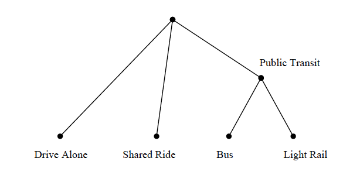
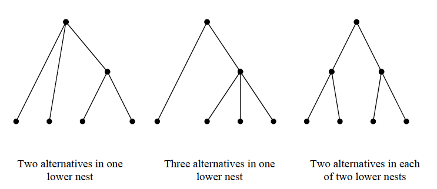

# Nested Logit Model {#nestedlogit-chapter}

## Motivation

The Multinomial Logit Model (MNL) structure has been widely used for both urban and intercity mode choice models primarily due to its simple mathematical form, ease of estimation and interpretation, and the ability to add or remove choice alternatives.  However, the MNL model has been widely criticized for its Independence of Irrelevant Alternatives (IIA) property (see [Section 4.2](#IIA-section).  The IIA property of the MNL restricts the ratio of the choice probabilities for any pair of alternatives to be independent of the existence and characteristics of other alternatives in the choice set.  This restriction implies that introduction of a new mode or improvements to any existing mode will reduce the probability of existing modes in proportion to their probabilities before the change.

The IIA property is a major limitation of the MNL model as it implies equal competition between all pairs of alternatives, an inappropriate assumption in many choice situations.  For example, in the case of urban mode choice among drive alone, shared ride, bus and light rail; the bus and light rail alternatives are likely to be more similar to each other than they are to either of the other alternatives due to shared attributes which are not included in the measured portion of the utility function; for example, bus and light rail may have the same fare structure and operating policies, the same lack of privacy, control of the environment, and so on.  Such similarities, if not included in the measured portion of the utility function, lead to correlation between the errors associated with these alternatives, a violation of the assumptions which underlie the derivation of the MNL.
	
The way in which this undesirable characteristic of the IIA property manifests itself can be illustrated using this example.  Assume that the choice probabilities (for an individual or a homogeneous group of individuals) are 65%, 15%, 10% and 10% for drive alone, shared ride, bus and light rail, respectively.  If the light rail service were to be improved in such a way as to increase its choice probability to 19%, the MNL model would predict that the shares of the other alternatives would decrease proportionately as shown in Table 8 1, decreasing the probability for the drive alone, shared ride and bus alternatives by a factor of 0.90.  As a result, the MNL model predicts that most of the increased light rail ridership comes from drive alone (6.5%) while only 1.5% comes from car pool and 1% from bus.  This is inconsistent with expectations and empirical evidence that most of the new light rail riders will be diverted from bus and carpool.  This inconsistency is a direct result of the IIA property of the MNL model.  Thus, in these types of choice situations, the MNL model will yield incorrect predictions of diversions from existing modes.
	
More extreme examples of this phenomenon have been described in the modeling literature.  Most widely known among them is the red bus/blue bus problem described in [Section 4.2.1](#bus-paradox).

These and numerous other examples illustrate that the IIA property is difficult to justify in situations where some alternatives compete more closely with each other than they do with other alternatives.  This limitation of the MNL model results from the assumption of the independence of error terms in the utility of the alternatives [Section 3.5](#additive-error-term), which is used to derive the model.  Different models can be derived through the use of different assumptions concerning the structure of the error distributions of alternative utilities.  Among them, the Nested Logit (NL) model (Williams, 1977; McFadden, 1978; Daly and Zachary, 1978), is the simplest and most widely used.  The NL model represents important deviations from the IIA property but retains most of the computational advantages of the MNL model (Borsch-Supan, 1987).  The NL model is characterized by grouping (or nesting) subsets of alternatives that are more similar to each other with respect to excluded characteristics than they are to other alternatives.

Alternatives in a common nest exhibit a higher degree of similarity and competitiveness than alternatives in different nests.  This level of competitiveness, represented by cross-elasticities between pairs of alternatives (the impact of a change in one mode on the probability of another mode) is identical for all pairs of alternatives in the nest.  Complex tree structures can be developed which offer substantial flexibility in representing differential competitiveness between pairs of alternatives; however, the nesting structure imposes a system of restrictions concerning relationships between pairs of alternatives as will be discussed later in this chapter.

## Formulation of Nested Logit Model

The derivation of the nested logit model is based on the assumption that some of
the alternatives share common components in their random error terms.  That is,
the random term of the nested alternatives can be decomposed into a portion
associated with each alternative and a portion associated with groups of
alternatives.  For example, consider an urban mode choice where a traveler has
four modes (drive alone, shared ride, commuter rail and bus) available for
making an intercity trip.  The utility equations for these alternatives are:

\usepackage{amsmath}
\begin{align}
U_{DA} &= V_{DA} + \epsilon_{DA} \\
U_{SR} &= V_{SR} + \epsilon_{SR} \\
U_{Bus} &= V_{PT} + V_{Bus} + \epsilon_{SR} + \epsilon_{Bus} \\
U_{LTR} &= V_{PT} + V_{LTR} + \epsilon_{SR} + \epsilon_{LTR}
(\#eq:eightone)
\end{align}

The utility terms for bus and light rail each include a distinct observed
component, $V_{Bus}$  and  $V_{LTR}$, and a common observed component, $V_{PT}$,
for public transit (PT); they also include distinct random components,
$\varepsilon_{Bus}$ and $\varepsilon_{LTR}$ , and a common random component,
$\varepsilon_{PT}$ .  The common error component creates a covariance between
the total errors for bus, $\varepsilon_{PT} + \varepsilon_{Bus}$ , and Light
Rail, $\varepsilon_{PT} + \varepsilon_{LTR}$ .  This covariance violates the
assumption underlying the MNL model representing an increased similarity between
pairs of nested alternatives (bus and Light Rail, in this case) and leads to
greater cross-elasticity between these alternatives.

The total error for each of the four alternatives is assumed to be distributed
Gumbel with scale parameter equal to one, as in the MNL model.  The variance of
these distributions is:
  

\begin{equation}
V_{AR} (\epsilon_{DA}) =  V_{AR} (\epsilon_{SR}) = V_{AR} (\epsilon_{PT} + \epsilon_{Bus}) = V_{AR} (\epsilon_{PT} + \epsilon_{LTR}) = \pi^2/6
(\#eq:eighttwo)
\end{equation}

The distinct error components, $\varepsilon_{Bus}$  and $\varepsilon_{LTR}$ , also are assumed to be distributed Gumbel, but with scale parameter, $\mu_{PT}$ .   However, in practice we estimate  $\theta_{PT} = \frac{1}{\mu_{PT}}$, the inverse of the Gumbel scale parameter.  $\theta_{PT}$  , commonly referred to as the logsum parameter, is bounded by zero and one.  That is, the variance of these distributions is:

\begin{equation}
V_{AR}(\epsilon_{Bus}) = V_{AR} (\epsilon_{LTR}) = \pi^2/(6 \mu_{PT}^2) = (\pi^2 \theta_{PT}^2)/6
(\#eq:eightthree)
\end{equation}

where	$\mu_{PT}$  is bounded by one and positive infinity ($\theta_{PT}$  is
bounded by zero and one) to ensure that the conditional variance for bus,
$Var(\varepsilon_{Bus})$ ,  is less than the total variance for bus,
$Var(\varepsilon_{PT}+\varepsilon_{Bus})$ , and similarly for Light Rail.  This
is required to ensure that the variance for the common public transit error
component, $\varepsilon_{PT}$ , is non-negative. These assumptions are adequate
to derive a nested logit model using utility maximization principles.  The
choice structure implied by these equations is depicted by the nesting structure
in Figure \@ref(fig:Twoleveltwoalternatives), in which bus and light rail are
more similar to each other than they are to drive alone and shared ride.

It is convenient to interpret this structure as if there are two levels of
choice even though the derivation of the model makes no assumptions about the
structure of the choice process .  The figure depicts an upper level (marginal)
choice among drive alone, shared ride, and public transit and a lower level
(conditional) choice between bus and light rail, given that public transit is
chosen.

(\#fig:Twoleveltwoalternatives)Two-Level Nest Structure with Two Alternatives in Lower Nest

The choice probabilities for the lower level nested alternatives (commuter rail or bus), conditional on choice of these alternatives are given by:

\begin{equation}
Pr(BUS/PT) = \frac{exp(V_{BUS}/ \theta_{PT})}{exp(V_{BUS}/ \theta_{PT}) + exp(V_{LTR}/ \theta_{PT})}
(\#eq:egihtfour)
\end{equation}

\begin{equation}
Pr(LTR/PT) = \frac{exp(V_{LTR}/ \theta_{PT})}{exp(V_{BUS}/ \theta_{PT}) + exp(V_{LTR}/ \theta_{PT})}
(\#eq:eightfive)
\end{equation}

This is the standard logit form except for the inclusion of the logsum parameter in the denominator of each utility function. The marginal choice probabilities for the drive alone, shared ride, and public transit alternatives are:

\begin{equation}
Pr(DA) = \frac{exp(V_{DA})} {exp(V_{DA}) + exp(V_{SR}) + exp(V_{PT} + \theta_{PT} \Gamma_{PT})}
(\#eq:egihtsix)
\end{equation}\

\begin{equation}
Pr(DA) = \frac{exp(V_{SR})} {exp(V_{DA}) + exp(V_{SR}) + exp(V_{PT} + \theta_{PT} \Gamma_{PT})}
(\#eq:egihtseven)
\end{equation}

\begin{equation}
Pr(DA) = \frac{exp(V_{PT} + \theta_{PT} \Gamma_{PT})} {exp(V_{DA}) + exp(V_{SR}) + exp(V_{PT} + \theta_{PT} \Gamma_{PT})}
(\#eq:eighteight)
\end{equation}

The expected utility of the public transit alternatives equals this value, $\Gamma_{PT}$ , times the logsum parameter, $\theta_{PT}$ , plus other attributes common to the pair of alternatives, $V_{PT}$ .  $\Gamma_{PT}$  is computed from the log of the sum of the exponents of the nested utilities (equations 8.4 and 8.5), commonly referred to as the “logsum” variable.  

\begin{equation}
  \Gamma_{PT} = log \left[ exp \left( \frac{V_{Bus}}{\theta_{PT}} \right) +exp \left( \frac{V_{LTR}}{\theta_{PT}} \right) \right]
  (\#eq:utilitytransit)
\end{equation}

An important feature of these equations is that the logsum parameter, $\theta_{PT}$, appears in the denominator of the conditional utility for all the nested alternatives.  The implication of this is that all of the utility function parameters, $\beta$, are scaled by a common value.  Since $\theta_{PT}$ is bounded by zero and one, the magnitudes of all the resultant parameters, $\beta/\theta_{PT}$, are increased implying that the choice between the nested alternatives is more sensitive to changes to any of the variables in these functions than are alternatives not in the nest.  Further, if the number of alternatives in any nest is reduced to one, the utility in the marginal model becomes identically equal to the utility for the remaining alternative.  That is, if the bus alternative is not available to some travelers, the utility of the nest becomes:

\begin{align*}
  V^*_{PT} &= V_{PT} + \theta_{PT} log \left[ exp \left( \frac{V_{LTR}}{\theta_{PT}} \right) \right] \\
  &= V_{PT} + V_{LRT}
  (\#eq:utilitytransitnest)
\end{align*}

The probability of choosing the nested alternatives can be obtained by multiplying the conditional probability of the nested alternative by the marginal probability as follows:

\begin{equation}
P(Bus) = P(Bus \mid PT) \times P(PT)
  (\#eq:probbus)
\end{equation}

\begin{equation}
P(Bus) = P(Bus \mid PT) \times P(PT)
  (\#eq:problightrail)
\end{equation}

### Interpretation of the Logsum Parameter {#logsum-param}

The logsum parameter, $\theta$ , (sometimes called the “dissimilarity parameter” or the “nesting coefficient”), is a function of the underlying correlation between the unobserved components for pairs of alternatives in that nest, and it characterizes the degree of substitutability between those alternatives.  The value of the logsum parameter is bounded by zero and one to ensure consistency with random utility maximization principles.  Different values of the parameter indicate the degree of dissimilarity between pairs of alternatives in the nest. The interpretation of different values of the logsum parameter is as follows:

  -	$\theta > 1$ Not consistent with the theoretical derivation.  Reject NL model.
  - $\theta = 1$ Implies zero correlation among mode pairs in the nest so the NL model collapses to the MNL model.
  - $0 < \theta < 1$ Implies non-zero correlation among pairs.  This range of values is appropriate for the nested logit model.  Decreasing values of $\theta$  indicate increased substitution between/among alternatives in the nest.
  - $\theta = 0$ Implies perfect correlation between pairs of alternatives in the nest.  That is, the choice between the nested alternatives, conditional on the nest, is deterministic.
  - $\theta < 0$ Not consistent with the theoretical derivation.  Therefore, we reject the nested logit model.

### Disaggregate Direct and Cross-Elasticities

The differences between the nested logit model and the multinomial logit model can be illustrated by comparison of the elasticities of each alternative to changes in the value of a variable associated with it (direct elasticity) or with another alternative (cross elasticity) as reported in Table 8-2.  The MNL direct- and cross-elasticity equations are the same for all alternatives.  This is a manifestation of the IIA property of the MNL model.  

However, the elasticity expressions for the NL model are differentiated between
cases in which the alternative being considered is or is not in the same nest as
the alternative which is changed.  Both models produce identical direct- and
cross-elasticities when the attribute that is changed is for one of the
non-nested alternatives.  However, the elasticity equations for changes in the
attributes of nested alternatives are different.  These differences are
attributable to the value of $\theta$  in the elasticity equations.  When
$\theta$  is equal to one, its maximum value, the expression,
$\frac{1-\theta}{\theta}$ , in the elasticity formulae in Table
\@ref(tab:nested-elasticity) becomes zero and the direct and cross-elasticity
expressions for the nested alternatives collapse to the corresponding equations
for the alternatives not in the nest.  

As the scale parameter, $\theta$ ,
decreases from one to zero, this expression increases and the direct- and
cross-elasticities within the nest become larger (possibly, much larger) than
the direct- and cross-elasticities between the nests.  That is, the sensitivity
of a nested alternative to changes in its attributes or to changes in the
attributes of other nested alternatives becomes much greater than the
corresponding changes for non-nested alternatives.  Although the same comparison
appears to exist between nested alternatives and similar alternatives in the MNL
model, this can only be evaluated by taking account of differences in the
$\beta$  parameters between the MNL and NL models.

	
<table class="table" style="margin-left: auto; margin-right: auto;">
 <thead>
  <tr>
   <th style="text-align:center;">  </th>
   <th style="text-align:center;"> Elasticity of Probability of Choosing Mode </th>
   <th style="text-align:center;"> Changes in Non-Nested Alternative, 'j' </th>
   <th style="text-align:center;"> Changed in Nested Alternative 'k' </th>
  </tr>
 </thead>
<tbody>
  <tr>
   <td style="text-align:center;"> Direct Elasticity </td>
   <td style="text-align:center;"> Multinomial Logit </td>
   <td style="text-align:center;"> $(1-P_j)\beta_{LOS}{LOS}_j$ </td>
   <td style="text-align:center;"> Not Applicable </td>
  </tr>
  <tr>
   <td style="text-align:center;">  </td>
   <td style="text-align:center;"> Nested Logit </td>
   <td style="text-align:center;"> $(1-P_j)\beta_{LOS}{LOS}_j$ </td>
   <td style="text-align:center;"> $\left( (1-P_k) + \left( \frac{1-\theta_N}{\theta_N} \right) (1-P_{k|N}) \right) \times \beta_{LOS}{LOS}_k$ </td>
  </tr>
  <tr>
   <td style="text-align:center;"> Cross Elasticity: Effect on Non-Nested Alternatives </td>
   <td style="text-align:center;"> Multinomial Logit </td>
   <td style="text-align:center;"> $-P_j \beta_{LOS}{LOS}_j$ </td>
   <td style="text-align:center;"> Not Applicable </td>
  </tr>
  <tr>
   <td style="text-align:center;">  </td>
   <td style="text-align:center;"> Nested Logit </td>
   <td style="text-align:center;"> $-P_j \beta_{LOS}{LOS}_j$ </td>
   <td style="text-align:center;"> $-P_k \beta_{LOS}{LOS}_k$ </td>
  </tr>
  <tr>
   <td style="text-align:center;"> Cross Elasticity: Effect on Nested Alternatives </td>
   <td style="text-align:center;"> Multinomial Logit </td>
   <td style="text-align:center;"> Not Applicable </td>
   <td style="text-align:center;"> Not Applicable </td>
  </tr>
  <tr>
   <td style="text-align:center;">  </td>
   <td style="text-align:center;"> Nested Logit </td>
   <td style="text-align:center;"> $-P_j \beta_{LOS}{LOS}_j$ </td>
   <td style="text-align:center;"> $- \left( P_k + \left( \frac{1-\theta_N}{\theta_N} \right)(P_{k|N}) \right) \times \beta_{LOS}{LOS}_k$ </td>
  </tr>
</tbody>
</table>

## Nesting Structures {#nesting-structures}

The assumptions underlying the model described in the preceding section (correlation of error terms for the bus and light rail alternatives) results in a two-level model with a single public transit nest for the four alternative (drive alone, shared ride, commuter rail, and bus) mode choice problem.  This nesting structure is one of many possible two-level nested logit models which can be constructed for a choice set with four alternatives.  The possible set of two-level nested logit models includes six combinations of two alternatives in a nest with the remaining alternatives at the upper level, four combinations of three alternatives in a nest and one at the upper level and three combinations of two alternatives in a nest and two alternatives in a parallel nest for a total of thirteen two level nest structures (Figure 8.2).  The number of two level nest structures increases rapidly with the number of alternatives as shown in Table 8-3 below.

(\#fig:Threetypestwolevelnests)Three Types of Two Level Nests

Some of these nesting structures are likely to be behaviorally unreasonable; for
example, it doesn’t seem reasonable to include bus and car in the same nest. The
selection of a preferred nesting structure requires a combination of judgment
(about reasonable nesting structures) and statistical hypothesis testing;
specifically, testing the hypothesis that the MNL or a simpler NL model is the
true model.

Further, sub-groups of alternatives within any group may themselves be more
similar to each other than to other alternatives in the larger group.
Representation of these differences in similarity can result in multiple levels
of nesting, hierarchically identifying increasingly similar alternatives at each
level (Borsch-Supan, 1987).  For example, in the four alternative case, the case
of three alternatives in a lower nest might represent alternatives that include
group riding (shared ride, bus and light rail).  If we believe that the bus and
light rail alternatives are more similar than either alternative is to shared
ride, utility equations with the following common error terms will show an
intermediate level of error correlation among all group travel modes, and an
additional level of error correlation between commuter rail and bus.

\begin{equation}
\begin{split}
U_{DA} & = V_{DA} + \epsilon_{DA} \\
U_{SR} & = V_{GRP} + V_{SR} + \epsilon_{GRP} + \epsilon_{SR} \\
U_{Bus} & = V_{GRP} + V_{PT} + V_{Bus} + \epsilon_{GRP} + \epsilon_{PT} + \epsilon_{Bus} \\
U_{LTR} & = V_{GRP} + V_{PT} + V_{LTR} + \epsilon_{GRP} + \epsilon_{PT} + \epsilon_{LTR}
\end{split}
\end{equation}

In this case, the group travel modes (shared ride, commuter rail and bus) will be nested at the second level and commuter rail and bus will be nested at the third or lowest level as shown in Figure 8.3.  In this model structure, the lower level nest is a binary choice between commuter rail and bus, conditional on choice of public transit; the second level nest represents a choice between shared ride and public transit conditional on group travel; and the highest level represents a choice between drive alone and group travel.

(\#fig:Threelevelfouralternatives)Three-Level Nest Structure for Four Alternatives

Twelve three-level nested structures are possible with four alternatives; these
are combinations of two alternatives at the lowest level, one alternative at the
intermediate level and one alternative at the upper level.

The probability equations for the two-level nested logit model can be extended
readily to the three-level case as illustrated below.  The probabilities for
each nested alternative in the lowest level, commuter rail or bus, conditional
on choice of public transit (PT) are given by:

\begin{equation}
Pr(Bus \mid PT) = \frac {\exp(\frac{V_{Bus}}{\theta_{PT}})} {\exp(\frac{V_{Bus}}{\theta_{PT}}) + \exp{\frac{V_{LTR}}{\theta_{PT}}}}
(\#eq:twolevelNLmodels)
\end{equation}

\begin{equation}
Pr(LTR \mid PT) = \frac {\exp(\frac{V_{LTR}}{\theta_{PT}})} {\exp(\frac{V_{Bus}}{\theta_{PT}}) + \exp{\frac{V_{LTR}}{\theta_{PT}}}}
(\#eq:threelevelNLmodels)
\end{equation}

where $\theta_{PT}$ is the logsum parameter at the lowest (i.e. public transit) nest level.

The probabilities for each alternative in the second level nest, shared ride and
public transit, conditional on the choice of group travel (GRP) modes are:

$\Gamma_{PT}$ is the "logsum" of the exponents of the nested utilites for the lower nest level:

\begin{equation}
\Gamma_{PT} = log(exp(\frac{V_{BUS}}{\theta_{PT}}) + exp(\frac{V_{LTR}}{\theta_{PT}}))
(\#eq:eighteen)
\end{equation}

Finally, the probabilities for automobile and the common carrier nest are:

\usepackage{amsmath}
\begin{align}
Pr(DA) = \frac{exp(V_{DA})} {exp(V_{DA}) + exp(V_{GRP} + \theta_{GRP} \Gamma_{GRP})} \\
Pr(GRP) = \frac{exp(V_{GRP} + \theta_{GRP} \Gamma_{GRP})} {exp(V_{DA}) + exp(V_{GRP} + \theta_{GRP} \Gamma_{GRP})}
(\#eq:eight19)
\end{align}

where $\theta_{GRP}$ is the logsum parameter for the intermediate level (*i.e.*,
for the common carrier modes), and $\Gamma_{GRP}$ is the logsum of the exponents
of the nested utilities for the intermediate nest:

\begin{equation}
\Gamma_{GRP} = log({exp \frac{V_{SR}}{\theta_{GRP}}+ exp \frac{V_{PT} + \theta_{PT} \Gamma_{PT}}{\theta_{GRP}}})
(\#eq:twenty)
\end{equation}

The marginal probabilities of shared ride, commuter rail and bus are the product of the probabilities of each branch from the root (top of the tree) to the alternative:

\usepackage{amsmath}
\begin{align}
Pr(SR) = Pr(SR|GRP) \times Pr(GRP) \\
Pr(BUS) = Pr(BUS|PT) \times Pr(PT|GRP) \times Pr(GRP) \\
Pr(LTR) = Pr(LTR|PT) \times Pr(PT|GRP) \times Pr(GRP) \\
(\#eq:eighttopone)
\end{align}

The value of the logsum parameters decrease as we go down the tree.  This
follows from the requirement that the error variance at each level of the tree
must be lower than at the next higher level since the total variance for each
alternative is fixed and the variance at each level of the tree must be positive
(non-negative).  The total variance for each alternative,
$Var(\varepsilon^*_{Mode})$ , is given by:

\begin{equation}
Var(\varepsilon^*_{DA})=\frac{\pi^2}{6}
(\#eq:Var-DA)
\end{equation}

\begin{equation}
Var(\varepsilon^*_{SR}) = Var(\varepsilon_{SR}+\varepsilon_{GRP})
=Var(\varepsilon_{SR})+ Var(\varepsilon_{GRP}) =\frac{\pi^2}{6}
(\#eq:Var-SR)
\end{equation}

\begin{equation}
Var(\varepsilon^*_{Bus}) = Var(\varepsilon_{GRP}+\varepsilon_{PT}+\varepsilon_{Bus})
=Var(\varepsilon_{GRP}) + Var(\varepsilon_{PT}) + Var(\varepsilon_{Bus}) =\frac{\pi^2}{6}
(\#eq:Var-Bus)
\end{equation}

\begin{equation}
Var(\varepsilon^*_{LTR}) = Var(\varepsilon_{GRP}+\varepsilon_{PT}+\varepsilon_{LTR})
=Var(\varepsilon_{GRP}) + Var(\varepsilon_{PT}) + Var(\varepsilon_{LTR}) =\frac{\pi^2}{6}
(\#eq:Var-LTR)
\end{equation}

The variance components for alternatives, group elements and public transit elements of each alternative are shown in the following figure.

(\#fig:Decompositionoferrorvariance)Decomposition of Error Variance

This figure helps to explain the hierarchical restrictions on logsum parameters.  [Section 8.2.1](#logsum-param) described the initial restriction on the logsum for a single nest level or a two level tree as follows: $0 < \theta < 1$ .  However, in multi-level tree structures, as shown in [Section 8.3](#nesting-structures), the logsum parameter at each level is restricted to be between zero and the logsum parameter at the next higher level of the nesting structure.  Thus, in the example in Figure 8.4 above, $0 < \theta_{Grp} < 1$  and $0 < \theta_{PT} < \theta_{Grp}$ .  This hierarchical restriction ensures that the variance of each error term in equations 8.22 through 8.25 is positive, as required.  In particular, the variances are defined as

\begin{equation}
Var(\varepsilon_{Total})=\frac{\pi^2}{6}
(\#eq:Var-Total)
\end{equation}

\begin{equation}
Var(\varepsilon_{GRP})=\frac{\pi^2\theta^2_{GRP}}{6}
(\#eq:Var-GRP)
\end{equation}

\begin{equation}
Var(\varepsilon_{PT})=\frac{\pi^2\theta^2_{PT}}{6}
(\#eq:Var-PT)
\end{equation}

\begin{equation}
Var(\varepsilon_{Total}-\varepsilon_{GRP})=\frac{\pi^2}{6}(1-\theta^2_{GRP})
(\#eq:Var-Total-minus-GRP)
\end{equation}

\begin{equation}
Var(\varepsilon_{GRP}-\varepsilon_{PT})=\frac{\pi^2}{6}(\theta^2_{GRP}-\theta^2_{PT})
(\#eq:Var-GRP-minus-PT)
\end{equation}

To ensure that all the variance components are positive, as required, the
nesting parameters must be constrained as shown 
$0 < \theta_{PT} < \theta_{Grp}$.  These hierarchical constraints apply to all levels of nested
logit models.  The examples of two-level and three-level nesting structures
shown in Figure \@ref(fig:Twoleveltwoalternatives) and Figure \@ref(fig:Threetypestwolevelnests) represent four of the twenty-eight different
nested models (13 two-level and 12 three-level) that are feasible for a
four-alternative case.  The number of distinct nests increases rapidly with an
increasing number of alternatives (see Table
\@ref(tab:possible-nesting-structures)).

The large number of feasible nesting structures poses a substantial problem of
determining which one best reflects the choice behavior of the population.  The
analyst’s judgment can be used to substantially reduce this to a smaller number
of realistic structures (based on our understanding of the competitive
relationships); however, the analyst needs to be cautious in excluding
structures since some apparently non-intuitive structures may have good fit
statistics and their interpretation may provide useful insight into the choice
behavior under study.
	
<table class="table" style="margin-left: auto; margin-right: auto;">
<caption>(\#tab:possible-nesting-structures)Number of Possible Nesting Structures</caption>
 <thead>
  <tr>
   <th style="text-align:center;"> Number of  Alternatives </th>
   <th style="text-align:center;"> Possible 2-Level  Nesting Structures </th>
   <th style="text-align:center;"> Possible 3-Level  Nesting Structures </th>
   <th style="text-align:center;"> Total Possible Nesting  Structures All Levels </th>
  </tr>
 </thead>
<tbody>
  <tr>
   <td style="text-align:center;"> 3 </td>
   <td style="text-align:center;"> 3 </td>
   <td style="text-align:center;"> 0 </td>
   <td style="text-align:center;"> 3 </td>
  </tr>
  <tr>
   <td style="text-align:center;"> 4 </td>
   <td style="text-align:center;"> 13 </td>
   <td style="text-align:center;"> 12 </td>
   <td style="text-align:center;"> 25 </td>
  </tr>
  <tr>
   <td style="text-align:center;"> 5 </td>
   <td style="text-align:center;"> 50 </td>
   <td style="text-align:center;"> 125 </td>
   <td style="text-align:center;"> 235 </td>
  </tr>
  <tr>
   <td style="text-align:center;"> 6 </td>
   <td style="text-align:center;"> 201 </td>
   <td style="text-align:center;"> 1040 </td>
   <td style="text-align:center;"> 2711 </td>
  </tr>
</tbody>
</table>

## Statistical Testing of Nested Logit Structures {#testing-NL-structures}

Adopting a nested logit model implies rejection of the MNL .  We can use
standard statistical tests of the hypothesis that the MNL model is the true
model since the nested logit model is a generalization of the MNL model.  In the
case of multiple nests, the hypothesis that the MNL is the true model is
equivalent to the hypothesis that all the logsum parameters are equal to one.
We can use the likelihood ratio statistic with degrees of freedom equal to the
number of logsum parameters (the number of restrictions between the NL and the
MNL) to test this hypothesis.  We reject the null hypothesis that the MNL model
is the correct model if the calculated value is greater than the test or
critical value for the distribution as:

\begin{equation}
$\displaystyle -2 \times [l^{MNL} - l^{NL}]\ge \chi^{2}_{n}$
(\#eq:log-likelihoodtestMNLmodel)
\end{equation}

where $n$ is the number of restrictions (nests) between the MNL and NL models.

In the case of a simple NL model with a single nest, we can use the t-statistic
to test the hypothesis that the logsum parameter is equal to one.  Even in a
more complex NL model, we can test each logsum term to determine if a portion of
the nesting structure can be eliminated.  For each case in which the hypothesis
that the logsum parameter is equal to one is not rejected, the corresponding
branch of the tree can be eliminated and the alternatives can go directly to the
next level.  The t-statistics must be evaluated for the appropriate null
hypothesis.  For nests directly under the root of the tree, the null hypothesis
is $H_0: \mu_k = 1$ ; for other nests, the null hypothesis is that the parameter
for that nest is equal to the parameter for the next higher nest in the tree.
That is, for a top level nest,

\begin{equation}
$\displaystyle t-statistic = \frac{\hat\theta - 1}{S_{k}}$
(\#eq:toplevelnest)
\end{equation}

where $\hat\theta$ is the estimate of the logsum parameter for nest {k},
1 is the hypothesized value against which the logsum parameter is being tested;
and $S_{k}$ is the standard error of the parameter estimate.

For other nests, 

\begin{equation}
$\displaystyle t-statistic = \frac{\hat\theta_{k \subset j} - \hat\theta_{j}}{\sqrt {S^{2}_{k\subset j} + S^{2}_{j}-2S_{k\subset j,j}}}$
(\#eq:toplevelnest)
\end{equation}

where $\hat\theta_{k\subset j}$ is the estimate of the logsum parameter for nest
$k$ that is included under nest $j$, $\hat\theta_{j}$ is the estimate of
the logsum parameter for nest $j$, $S^{2}_{k\subset j}$ is the error variance
of the logsum parameter for nest $k$ that is included under nest $j$, $S^{2}_{j}$
is the error variance of the logsum parameter for nest $j$, and $S_{k\subset j,j}$
is the error covariance of the two logsum parameters.

It is important to note that these are not necessarily the test values that will
be reported by all computer programs, many of which apply the test for the null
hypothesis that the logsum is equal to zero or one only.  If the test against
zero is reported , the user must obtain or calculate the standard errors of
estimate for the relevant parameters and calculate the t-statistic(s) as defined
above.

The likelihood ratio test can also be used to test the significance of more complex nested models or between models with different nesting structures as long as the nesting structure of one model can be obtained as a restriction of the other.  To choose between two nested logit models where neither model is a restricted version of the other, we use the non-nested hypothesis test discussed in [CHAPTER 5](#chapter5) [section 5.7.3.2](#section5-7-3-2).
